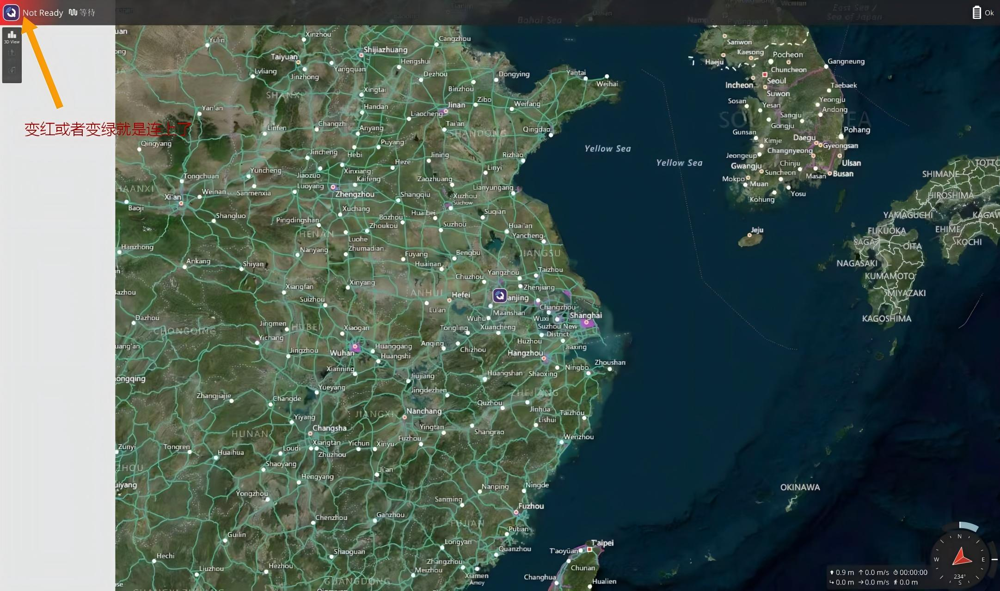
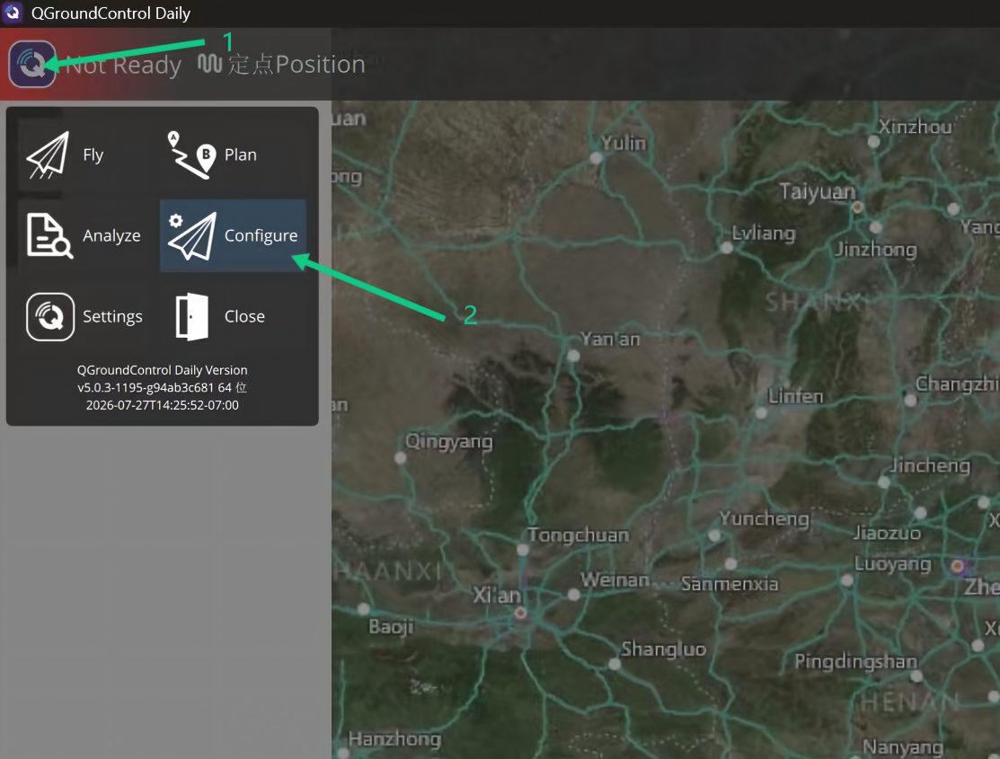
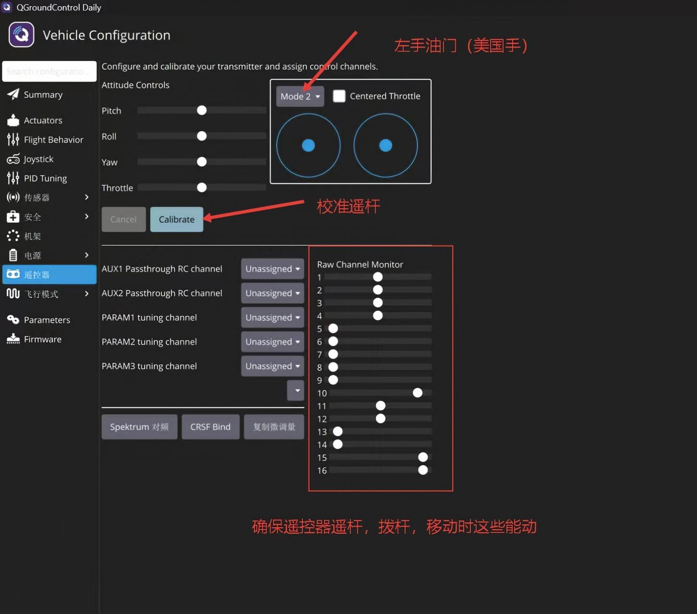
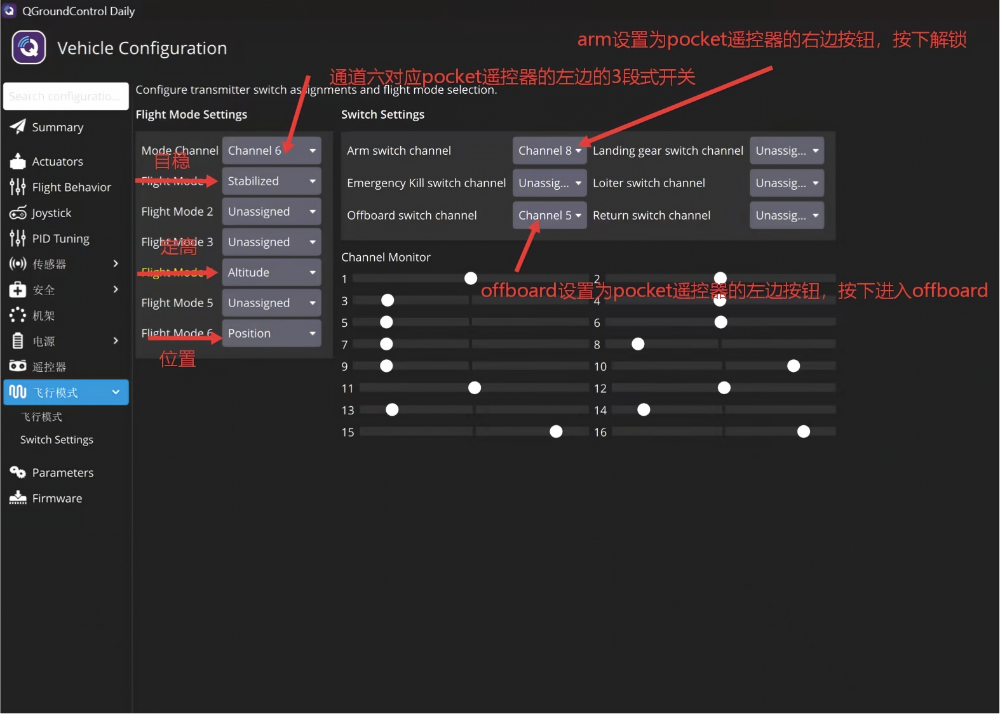
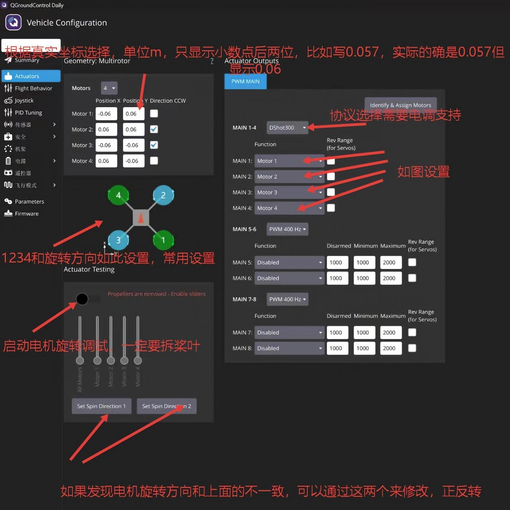
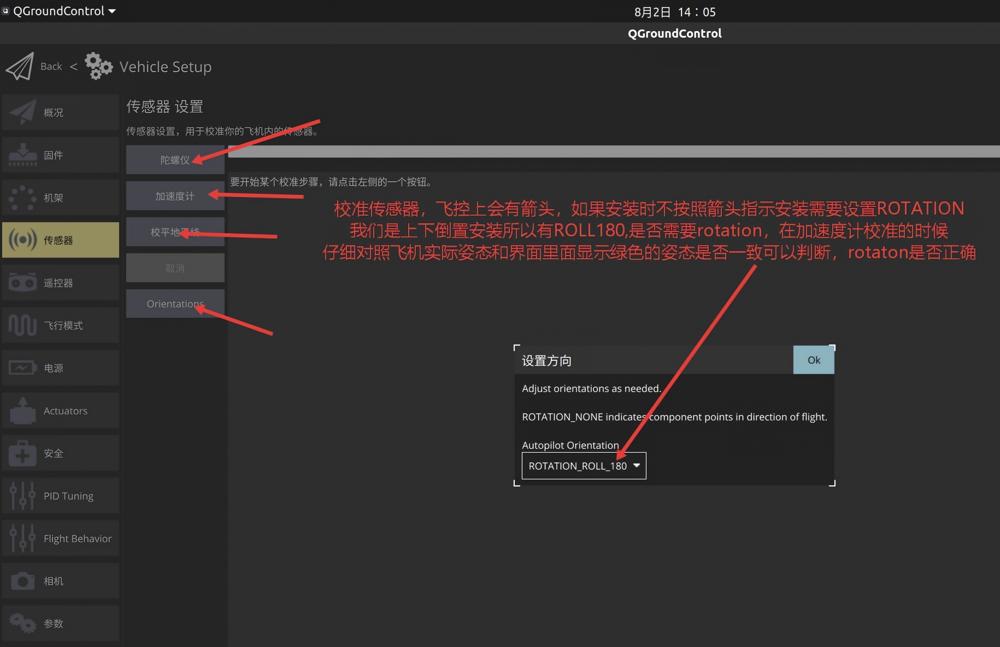

# QGC 设置

| 步骤 | 内容 | 媒体 | 详情 |
|---:|---|---|---|
| 0 | 接收机与遥控器对频 | 视频 | [查看详细介绍](#step-00-radio-bind) |
| 1 | 打开 QGroundControl 并连接飞控 | 图片 | [查看详细介绍](#step-01-open-qgc) |
| 2 | 进入 Configure / 配置页面 | 图片 | [查看详细介绍](#step-02-configure-page) |
| 3 | 遥控器通道校准 | 图片 | [查看详细介绍](#step-03-radio-calibration) |
| 4 | 飞行模式与开关设置 | 图片 | [查看详细介绍](#step-04-flight-mode) |
| 5 | Actuators / 电机电调设置 | 图片 | [查看详细介绍](#step-05-actuators) |
| 6 | 传感器方向与校准设置 | 图片 | [查看详细介绍](#step-06-sensors) |

## QGC 设置详细介绍

### 第 0 步、接收机与遥控器对频

**用到的材料：** 遥控器、接收机、已安装好的无人机或单独接收机供电环境。

**步骤目标：** 让接收机和遥控器完成对频，保证后续 QGC 能读取遥控器通道输入。

**操作演示：**

<video controls src="QGC配置images/第0步接收机遥控器对频.mp4" width="100%"></video>

[无法播放视频时，点击打开第 0 步视频](QGC配置images/第0步接收机遥控器对频.mp4)

**操作流程：**

> 在这里补充第 0 步的具体操作流程。

1. 待填写：
2. 待填写：
3. 待填写：

**注意事项：** 对频完成后，先确认遥控器和接收机指示灯状态正常，再进入 QGC 进行通道检查。

[返回 QGC 设置目录](#qgc-setup-list)

### 第 1 步、打开 QGroundControl 并连接飞控

**用到的材料：** 已安装好的无人机、飞控 USB 线、电脑、QGroundControl。

**步骤目标：** 打开 QGC，确认飞控已连接，进入主界面。

**步骤图片：**

**操作流程：**

> 在这里补充第 1 步的具体操作流程。

1. 待填写：
2. 待填写：
3. 待填写：

**注意事项：** 连接飞控和配置参数时先不要安装桨叶，避免误触发电机造成危险。

[返回 QGC 设置目录](#qgc-setup-list)

### 第 2 步、进入 Configure / 配置页面

**用到的材料：** 已连接 QGC 的飞控、电脑。

**步骤目标：** 从 QGC 主菜单进入 Configure / 配置页面，开始车辆设置。

**步骤图片：**

**操作流程：**

> 在这里补充第 2 步的具体操作流程。

1. 待填写：
2. 待填写：
3. 待填写：

**注意事项：** 如果 QGC 没有显示 Configure / 配置入口，先确认飞控是否已经正常连接并完成参数下载。

[返回 QGC 设置目录](#qgc-setup-list)

### 第 3 步、遥控器通道校准

**用到的材料：** 遥控器、接收机、已连接 QGC 的飞控。

**步骤目标：** 让 QGC 正确识别油门、横滚、俯仰、偏航以及辅助通道。

**步骤图片：**

**操作流程：**

> 在这里补充第 3 步的具体操作流程。

1. 待填写：
2. 待填写：
3. 待填写：

**注意事项：** 校准时观察 Raw Channel Monitor / 原始通道监视器，确认摇杆和开关动作都能被 QGC 识别。

[返回 QGC 设置目录](#qgc-setup-list)

### 第 4 步、飞行模式与开关设置

**用到的材料：** 遥控器、已连接 QGC 的飞控。

**步骤目标：** 绑定飞行模式通道、解锁开关、Offboard 开关等常用控制开关。

**步骤图片：**

**操作流程：**

> 在这里补充第 4 步的具体操作流程。

1. 待填写：
2. 待填写：
3. 待填写：

**注意事项：** 首次测试建议至少保留一个稳定类飞行模式，并确认解锁开关方向符合预期。

[返回 QGC 设置目录](#qgc-setup-list)

### 第 5 步、Actuators / 电机电调设置

**用到的材料：** 已焊接完成的电机、电调、飞控、电池、QGroundControl。

**步骤目标：** 设置电机数量、输出通道、电调协议和电机方向，确认电机编号与机架图一致。

**步骤图片：**

**操作流程：**

> 在这里补充第 5 步的具体操作流程。

1. 待填写：
2. 待填写：
3. 待填写：

**注意事项：** 所有电机测试、ESC 校准、执行器测试都必须拆桨。电机只需要低油门短时间确认，不要长时间空转。

[返回 QGC 设置目录](#qgc-setup-list)

### 第 6 步、传感器方向与校准设置

**用到的材料：** 已安装好的无人机、平整桌面、QGroundControl，必要时准备远离强磁场的空旷位置。

**步骤目标：** 设置飞控安装方向，并完成陀螺仪、加速度计、水平和罗盘等传感器校准。

**步骤图片：**

**操作流程：**

> 在这里补充第 6 步的具体操作流程。

1. 待填写：
2. 待填写：
3. 待填写：

**注意事项：** 罗盘校准失败时不要直接飞行。先换一个远离磁干扰的位置，再检查飞控、电源线、电调和电池是否离罗盘太近。

[返回 QGC 设置目录](#qgc-setup-list)

## 配置后检查

1. 遥控器通道方向、油门最低位、解锁开关和飞行模式切换正常。
2. 电机编号、旋转方向、电调协议和输出通道与实际硬件一致。
3. 飞控安装方向、机头方向和 QGC 姿态显示一致。
4. QGC 顶部状态栏没有关键红色告警后，再进行后续地面测试。

## 参考资料

- [QGroundControl Radio Setup](https://docs.qgroundcontrol.com/master/en/qgc-user-guide/setup_view/radio.html)
- [QGroundControl Motor Setup](https://docs.qgroundcontrol.com/master/en/qgc-user-guide/setup_view/motors.html)
- [QGroundControl Sensors](https://docs.qgroundcontrol.com/master/en/qgc-user-guide/setup_view/sensors.html)
- [QGroundControl First Flight Guide](https://docs.qgroundcontrol.com/master/en/qgc-user-guide/getting_started/quick_start.html)
- [PX4 Actuator Configuration and Testing](https://docs.px4.io/main/en/config/actuators)
