# 无人机硬件清单

| 硬件名 | 数量 | 功能简介 |
|---|---:|---|
| 边缘计算机套件：Nvidia Orin NX | 1 | [查看详细介绍](#detail-orin-nx) |
| RGB-D 深度相机：RealSense D455 | 1 | [查看详细介绍](#detail-d455) |
| 飞控：NxtPX4 | 1 | [查看详细介绍](#detail-nxtpx4) |
| 电调：45A（当前使用，型号待补充） | 1 | [查看详细介绍](#detail-esc-45a) |
| 电机：OddityRC 2006 2150KV 四个装 | 1 | [查看详细介绍](#detail-motor) |
| 螺旋桨：GEMFAN D90s-3 四个装 | 1 | [查看详细介绍](#detail-propeller) |
| 电池：1400mAh 6S | 1 | [查看详细介绍](#detail-battery) |
| 电池防撞护垫 | 1 | [查看详细介绍](#detail-battery-protector) |
| 电池绑带：凯夫拉 20×280mm 防滑扎带 | 1 | [查看详细介绍](#detail-battery-strap) |
| 桨叶保护罩：OddityRC XI35 Pro | 1 | [查看详细介绍](#detail-prop-guard) |
| 接收器：瑞速 | 1 | [查看详细介绍](#detail-receiver) |
| 遥控器 | 1 | [查看详细介绍](#detail-transmitter) |
| 电源接口：XT60 E1-M | 1 | [查看详细介绍](#detail-xt60-em) |
| XT30 对（10 个装） | 1 | [查看详细介绍](#detail-xt30) |
| 计算机电源线：18 AWG 红色，1m 长 | 4 | [查看详细介绍](#detail-power-red) |
| 计算机电源线：18 AWG 黑色，1m 长 | 4 | [查看详细介绍](#detail-power-black) |
| 硅胶线：28 AWG 绿色，0.08平方，5m 长 | 1 | [查看详细介绍](#detail-wire-28awg-green) |
| 硅胶线：28 AWG 白色，0.08平方，5m 长 | 1 | [查看详细介绍](#detail-wire-28awg-white) |
| 硅胶线：28 AWG 红色，0.08平方，5m 长 | 1 | [查看详细介绍](#detail-wire-28awg-red) |
| 硅胶线：28 AWG 黑色，0.08平方，5m 长 | 1 | [查看详细介绍](#detail-wire-28awg-black) |
| 相机 Type-C 线 | 1 | [查看详细介绍](#detail-camera-cable) |
| Type-C 调试母座（机架下板安装位） | 1 | [查看详细介绍](#detail-debug-female) |
| Type-C 调试公头 | 1 | [查看详细介绍](#detail-debug-male) |
| DC-DC 降压模块，输出 12V 5A | 1 | [查看详细介绍](#detail-dcdc) |
| 铝合金支柱：M3×12mm | 7颗 | [查看详细介绍](#detail-standoff) |
| 内六角沉头螺丝M3×10mm | 7颗 | [查看详细介绍](#detail-screw) |
| 尼龙螺丝：M2×20mm，白色 | 4颗 | [查看详细介绍](#detail-nylon-screw-m2-20) |
| 尼龙螺母：M2，白色 | 8颗 | [查看详细介绍](#detail-nylon-nut-m2) |
| 内六角沉头螺丝：M3×20mm | 6颗 | [查看详细介绍](#detail-countersunk-m3-20) |
| 内六角沉头螺丝：M2.5×10mm | 2颗 | [查看详细介绍](#detail-countersunk-m2-5-10) |
| 内六角平头螺丝：M4×8mm | 2颗 | [查看详细介绍](#detail-screw-m4-8) |
| 平头螺丝：M3×12mm | 2颗 | [查看详细介绍](#detail-flat-screw-m3-12) |
| 防松螺母：M3 | 2颗 | [查看详细介绍](#detail-locknut-m3) |
| 缓冲泡棉（用于电池，2m） | 1 | [查看详细介绍](#detail-foam) |
| 3M 背胶魔术贴：黑色，2cm 宽，3m 勾面 + 3m 毛面 | 1 | [查看详细介绍](#detail-velcro) |
| 尼龙扎带：白色，25cm，中粗，100条装 | 1 | [查看详细介绍](#detail-zip-tie) |
| 固态电容：680µF（更紧凑） | 1 | [查看详细介绍](#detail-capacitor) |
| 热缩管：黑色，圆直径 4mm，按 2m 散卖 | 1 | [查看详细介绍](#detail-heatshrink-4mm) |
| 热缩管：黑色，圆直径 2mm，按 2m 散卖 | 1 | [查看详细介绍](#detail-heatshrink-2mm) |
| 3K 东丽碳纤维板定制加工 | 1 | [查看详细介绍](#detail-carbon-fiber) |
| PETG 3D 打印定制件 | 6 | [查看详细介绍](#detail-petg-print) |
| BB 响 | 1 | [查看详细介绍](#detail-buzzer) |

## 硬件详细介绍

### 边缘计算机套件：Nvidia Orin NX

**具体型号：**

Allspark 2-Orin NX 16G+128G SSD+wifi版本 100TOPS

**功能简介：**

Nvidia Orin NX 是无人机上的机载边缘计算平台。

**参考图片：**

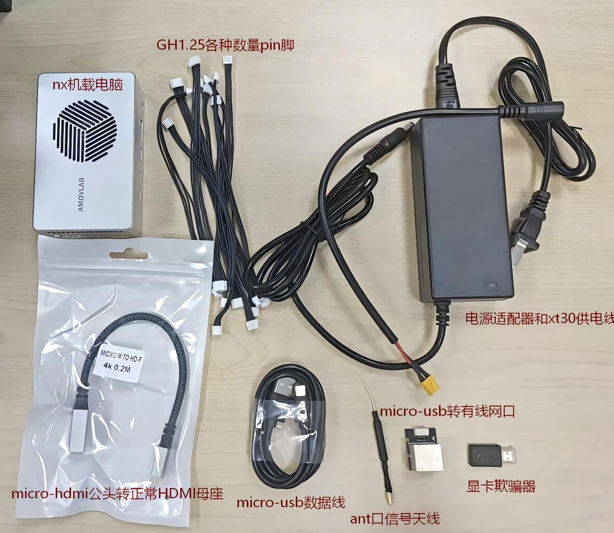
**淘宝购买链接：**

[点击查看机载电脑商品（SKU：5396774401953）](https://item.taobao.com/item.htm?id=705748339987&skuId=5396774401953)

[返回硬件清单](#hardware-list)

### RGB-D 深度相机：RealSense D455

**功能简介：** 用于采集彩色图像和深度信息，为目标识别、测距、避障和定位提供视觉数据。

**参考图片：**

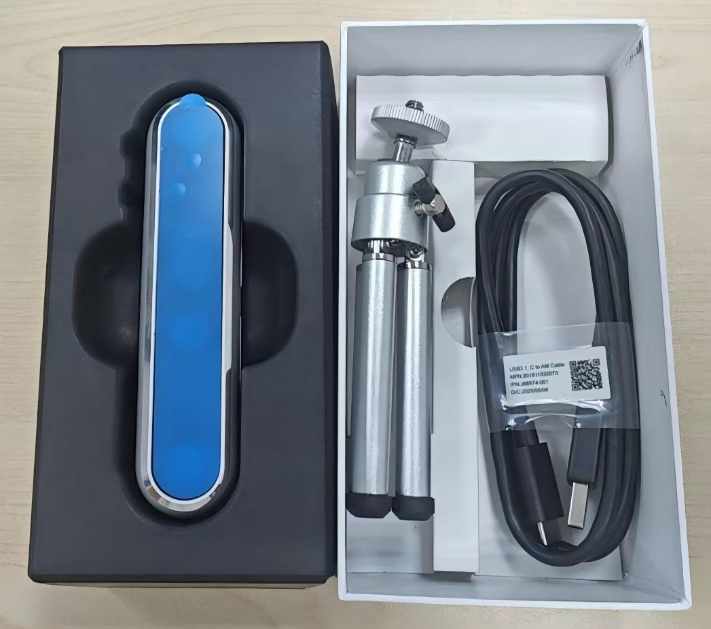
**淘宝购买链接：**

[点击查看深度相机商品（SKU：4457168412136）](https://item.taobao.com/item.htm?id=559722720199&skuId=4457168412136)

[返回硬件清单](#hardware-list)

### 飞控：NxtPX4

**功能简介：** 负责姿态估计、飞行控制、电机输出以及与遥控器、接收器和机载计算机的通信。

**淘宝购买链接：**

[点击查看飞控商品（SKU：6048678263114）](https://item.taobao.com/item.htm?id=955672079963&skuId=6048678263114)

**参考图片：**

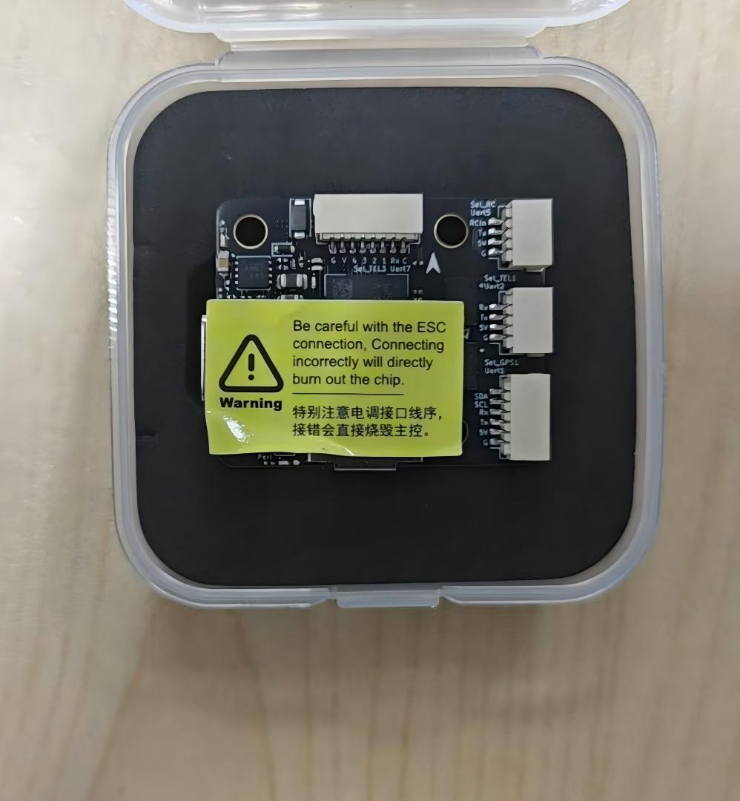
[返回硬件清单](#hardware-list)

### 电调：45A（当前使用，型号待补充）

**功能简介：** 将 6S 电池的直流电转换为三相驱动信号，控制四个无刷电机的转速和方向。

**状态：** 当前方案使用尺寸匹配的 45A 电调，具体品牌、型号和淘宝购买链接待补充。

**参考图片：**

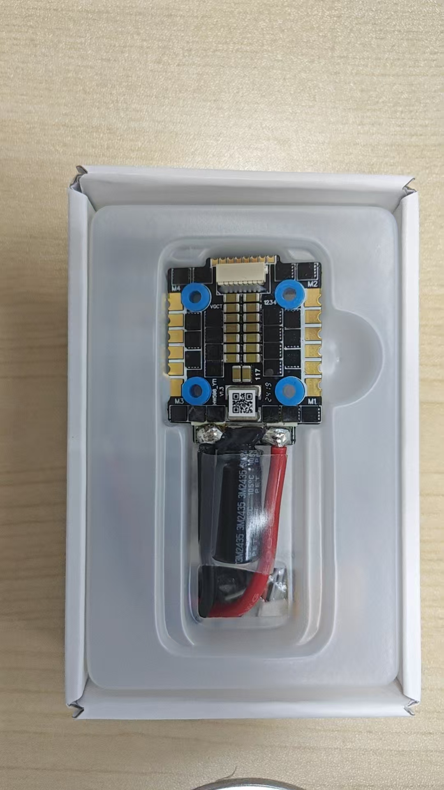
[返回硬件清单](#hardware-list)

### 电机：OddityRC 2006 2150KV 四个装

**功能简介：** 为螺旋桨提供旋转动力，是无人机动力系统的核心执行部件；本款 2006 2150KV 电机适配三孔螺旋桨安装方式。

**参考图片：**

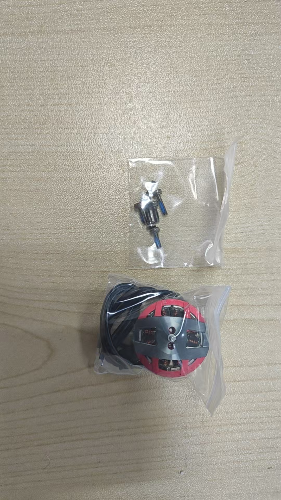
**历史购买链接：**

[查看原 OddityRC 2006 电机商品（已售罄）](https://item.taobao.com/item.htm?id=793989229752&sku_properties=1627207%3A32402027293)

> 该商品已经卖完，此链接仅用于记录当初购买的型号，不代表当前可购买。

[返回硬件清单](#hardware-list)

### 螺旋桨：GEMFAN D90s-3 四个装

**功能简介：** 将电机的旋转动力转换为升力和推力，是无人机产生飞行动力的部件。

**参考图片：**

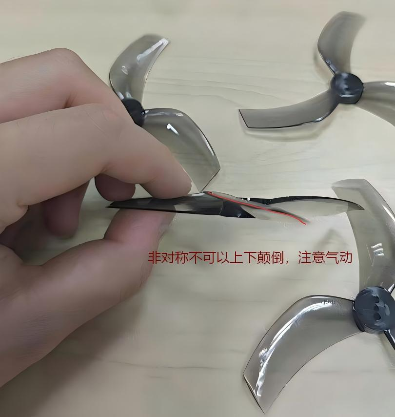
**购买链接：**

[点击查看三孔螺旋桨商品（SKU：5675481147990）](https://item.taobao.com/item.htm?id=811737228893&skuId=5675481147990)

> 本电机为中间光轴、两侧带安装孔，因此选用三孔螺旋桨；如果电机只有中间单轴、没有两侧安装孔，应改用单孔螺旋桨。

[返回硬件清单](#hardware-list)

### 电池：1400mAh 6S

**功能简介：** 为电机、电调和机载电子设备提供 6S 直流电源，是无人机的主要动力能源。

**参考图片：**

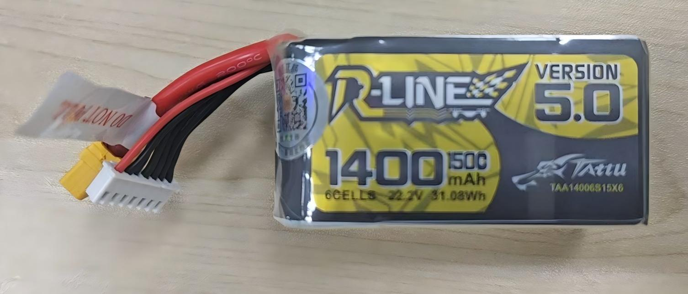
**淘宝购买链接：**

[点击查看淘宝商品（SKU：5449796720472）](https://item.taobao.com/item.htm?id=677691756050&skuId=5449796720472)

**参考购买价：** 166.50 元

[返回硬件清单](#hardware-list)

### 电池防撞护垫

**功能简介：** 用于缓冲电池与机架或周边结构的碰撞，减少电池外壳磨损和飞行振动。

**参考图片：**

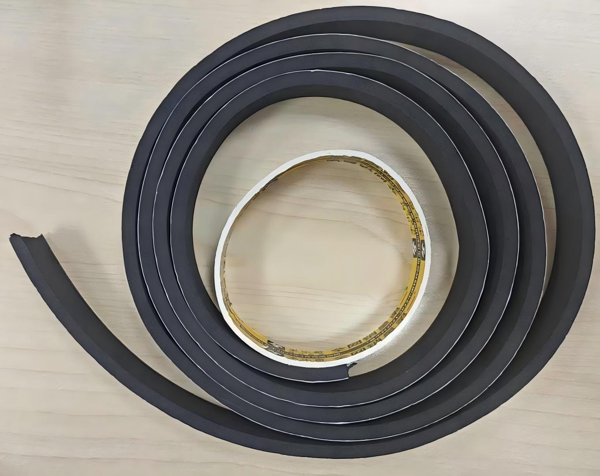
**淘宝购买链接：**

[点击查看电池防撞商品（SKU：6010611489926）](https://item.taobao.com/item.htm?id=1008514063717&skuId=6010611489926)

[返回硬件清单](#hardware-list)

### 电池绑带：凯夫拉 20×280mm 防滑扎带

**功能简介：** 用于固定 5 寸及 7 寸穿越机电池，防止电池在飞行过程中移动或脱落。

**规格：** 凯夫拉材质，20×280mm，防滑款，数量 4。

**淘宝购买链接：**

[点击查看商品（商品 ID：752606680898）](https://item.taobao.com/item.htm?id=752606680898)

**参考图片：**

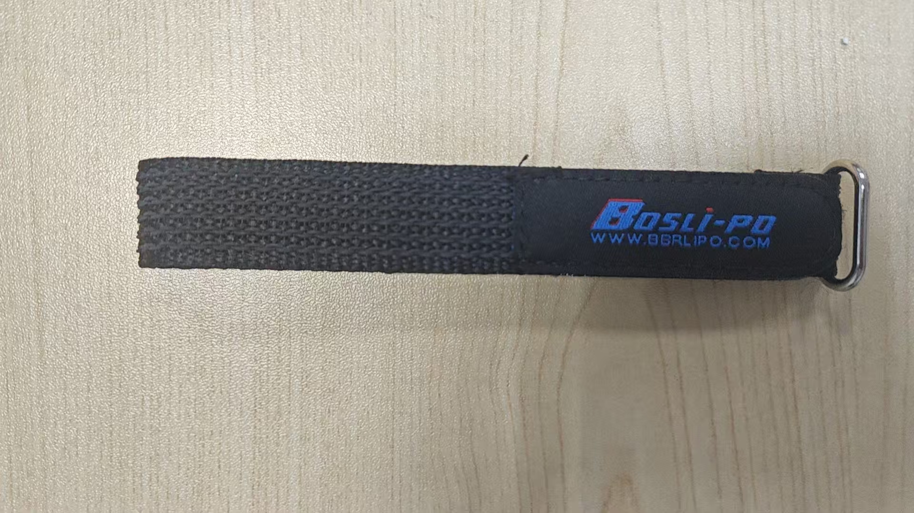
[返回硬件清单](#hardware-list)

### 桨叶保护罩：OddityRC XI35 Pro

**功能简介：** 用于隔离螺旋桨与外部障碍物，降低碰撞时桨叶和人员受伤的风险。

**参考图片：**

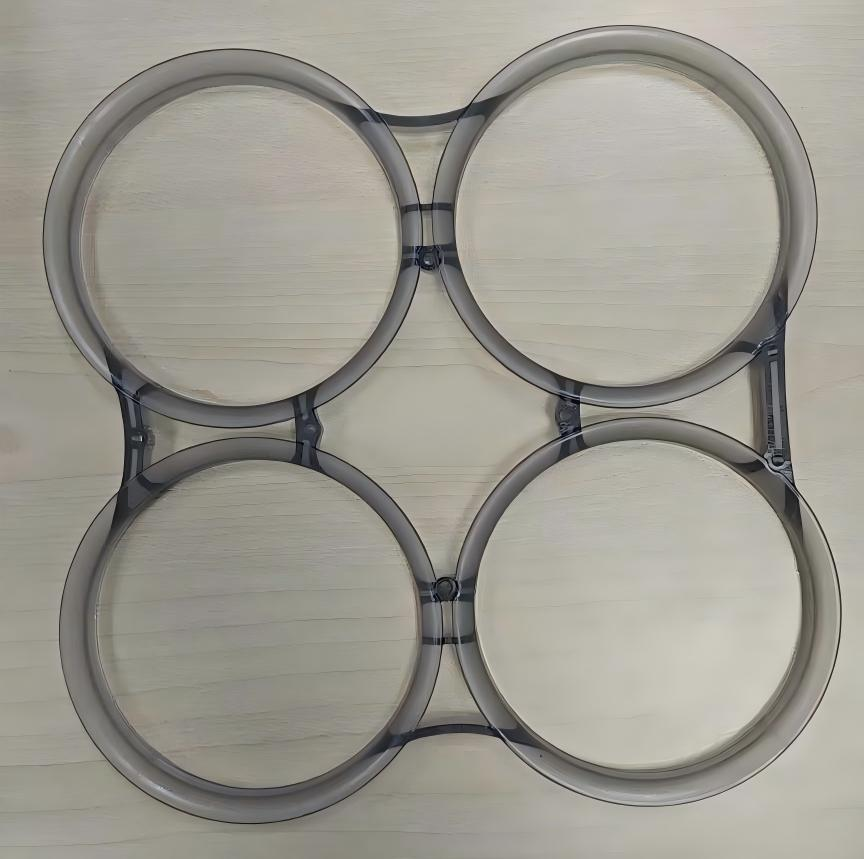
**淘宝购买链接：**

[点击查看涵道保护圈商品（SKU：5815214173777）](https://item.taobao.com/item.htm?id=930567172186&skuId=5815214173777)

[返回硬件清单](#hardware-list)

### 接收器：瑞速

**功能简介：** 接收遥控器发出的控制指令，并传递给飞控执行油门、姿态和模式控制。

**参考图片：**

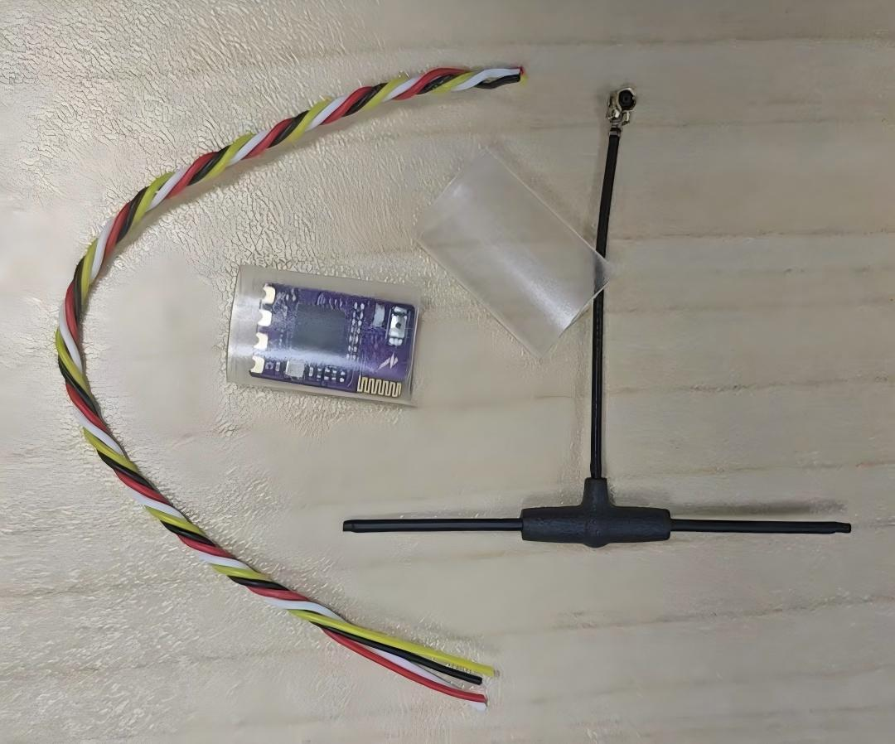
**淘宝购买链接：**

[点击查看接收机商品（SKU：6059615692701）](https://item.taobao.com/item.htm?id=1039148819082&skuId=6059615692701)

[返回硬件清单](#hardware-list)

### 遥控器

**功能简介：** 用于向接收器发送飞行控制、模式切换和安全解锁指令。

**参考图片：**

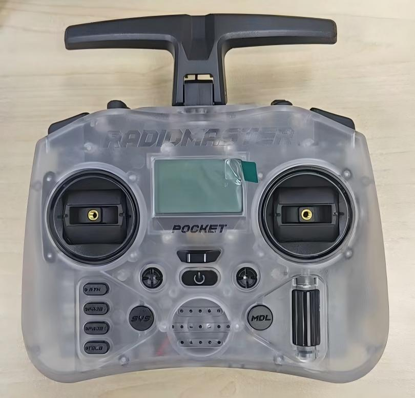
**淘宝购买链接：**

[点击查看遥控器商品（SKU：5690791865430）](https://item.taobao.com/item.htm?id=789612406107&skuId=5690791865430)

[返回硬件清单](#hardware-list)

### 电源接口：XT60 E1-M

**功能简介：** 提供电池与无人机电源系统之间的大电流可插拔连接。

**参考图片：**

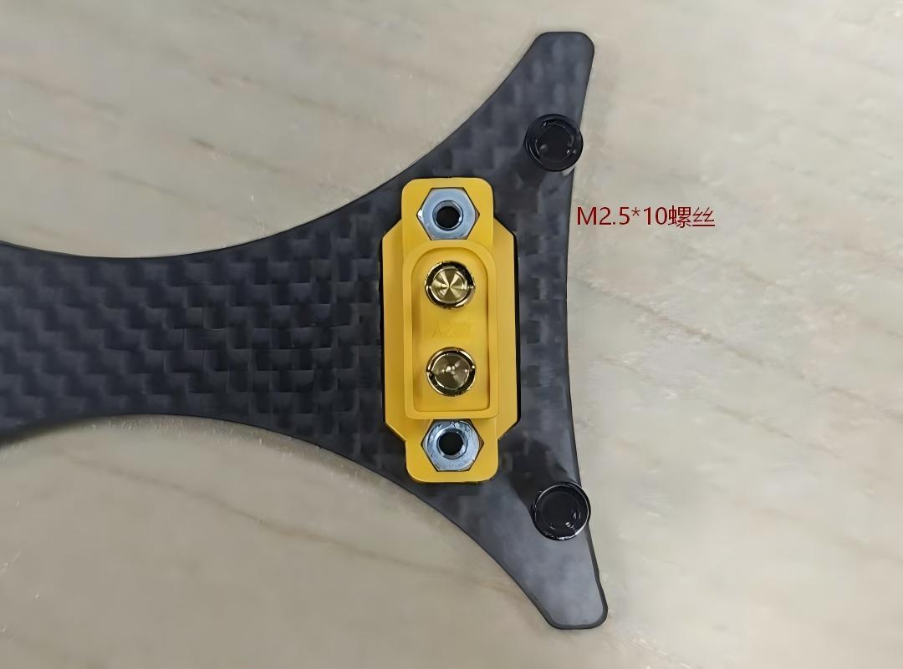
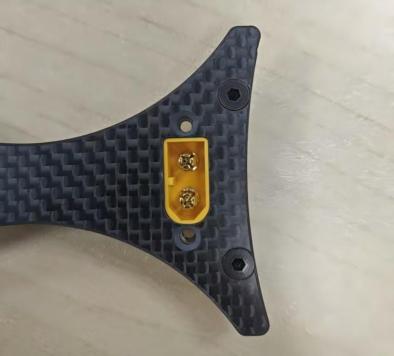
**淘宝购买链接：**

[点击查看 XT60 E1-M 公头商品（SKU：4662287222244）](https://detail.tmall.com/item.htm?id=631049982867&skuId=4662287222244)

> 机架下板为该 XT60E1-M 预留了安装位；商品不含固定用 M2 螺丝，需另行准备。

[返回硬件清单](#hardware-list)

### XT30 对（10 个装）

**功能简介：** 用于较小电流的辅助电源连接，例如风扇、灯光或小型模块。

**淘宝购买链接：**

[点击查看 XT30 公母对商品（SKU：5808932883156）](https://item.taobao.com/item.htm?id=849568874754&skuId=5808932883156)

> 该 XT30 公母对用于机载电脑供电。

**参考图片：**

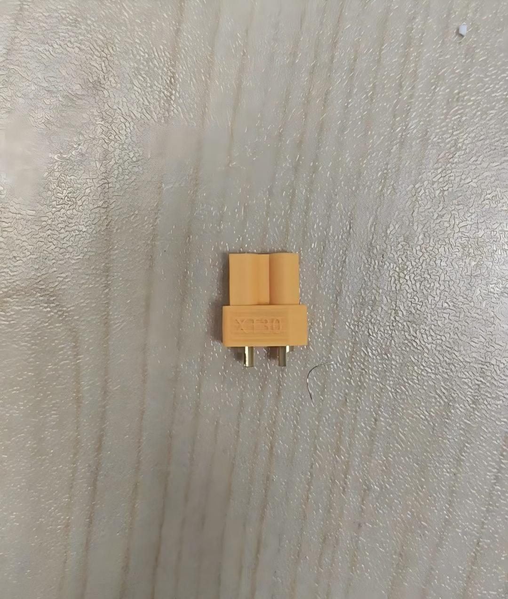
[返回硬件清单](#hardware-list)

### 计算机电源线：18 AWG 红色，1m 长

**功能简介：** 作为计算机或机载设备电源连接中的正极线，提供较大电流承载能力。

**淘宝购买链接：**

[点击查看红色 18 AWG 硅胶线商品（SKU：4599704214171）](https://detail.tmall.com/item.htm?id=624893192274&skuId=4599704214171)

**参考图片：**

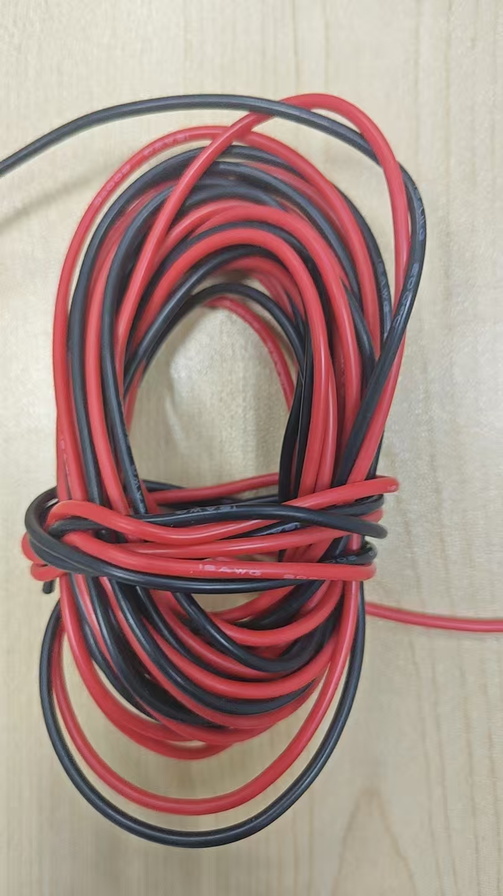
[返回硬件清单](#hardware-list)

### 计算机电源线：18 AWG 黑色，1m 长

**功能简介：** 作为计算机或机载设备电源连接中的负极/地线，与红色电源线配合使用。

**淘宝购买链接：**

[点击查看黑色 18 AWG 硅胶线商品（SKU：4599704214172）](https://detail.tmall.com/item.htm?id=624893192274&skuId=4599704214172)

> 该 18 AWG 线用于 XT30 接线，配套使用 4mm 热缩管。

**参考图片：**

[返回硬件清单](#hardware-list)

### 硅胶线：28 AWG 绿色，0.08平方，5m 长

**功能简介：** 用于低电流信号、控制和辅助连接线路。

**规格：** 28 AWG，0.08平方，绿色，5m。

**淘宝购买链接：**

[点击查看商品（商品 ID：736162720327）](https://item.taobao.com/item.htm?id=736162720327)

[返回硬件清单](#hardware-list)

### 硅胶线：28 AWG 白色，0.08平方，5m 长

**功能简介：** 用于低电流信号、控制和辅助连接线路。

**规格：** 28 AWG，0.08平方，白色，5m。

**淘宝购买链接：**

[点击查看商品（商品 ID：736162720327）](https://item.taobao.com/item.htm?id=736162720327)

[返回硬件清单](#hardware-list)

### 硅胶线：28 AWG 红色，0.08平方，5m 长

**功能简介：** 用于低电流信号、控制和辅助连接线路；红色可作为正极或电源标识线。

**规格：** 28 AWG，0.08平方，红色，5m。

**淘宝购买链接：**

[点击查看商品（商品 ID：736162720327）](https://item.taobao.com/item.htm?id=736162720327)

[返回硬件清单](#hardware-list)

### 硅胶线：28 AWG 黑色，0.08平方，5m 长

**功能简介：** 用于低电流信号、控制和辅助连接线路；黑色可作为负极或地线标识线。

**规格：** 28 AWG，0.08平方，黑色，5m。

**淘宝购买链接：**

[点击查看商品（商品 ID：736162720327）](https://item.taobao.com/item.htm?id=736162720327)

[返回硬件清单](#hardware-list)

### 相机 Type-C 线

**功能简介：** 用于连接 RealSense D455 等相机与边缘计算机，传输图像、深度数据并提供接口供电。

**购买说明：**

>  yopo提供的相机 Type-C 链接不适配当前设备，不要购买，也不作为本清单的有效购买链接。应使用与 RealSense D455 接口匹配的正确线材。

**参考图片：**

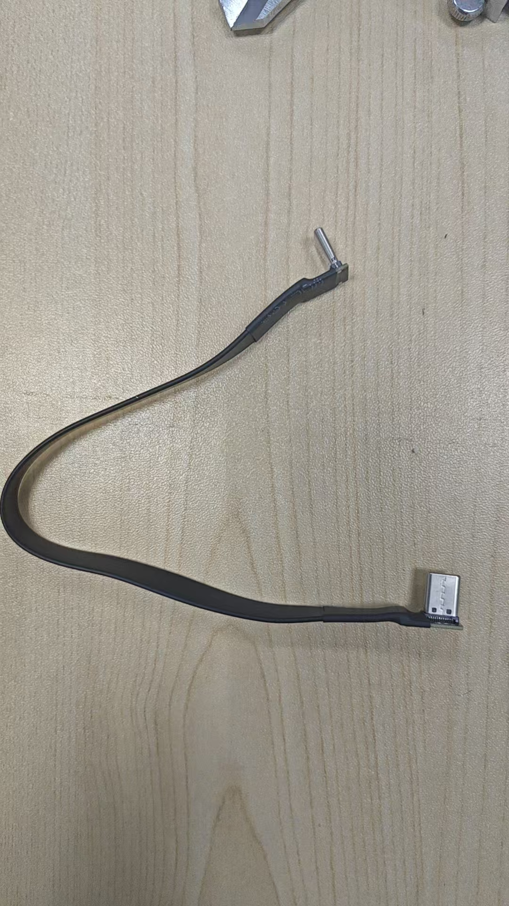
[返回硬件清单](#hardware-list)

### Type-C 调试母座（机架下板安装位）

**功能简介：** 作为可插拔的调试和烧录连接端，用于临时接入飞控或其他控制板。这个东西和公头连起来以后，公头插飞控，母座放底板上，方便调试，本质是一个转接功能。母座需要导圆角。

**参考图片：**

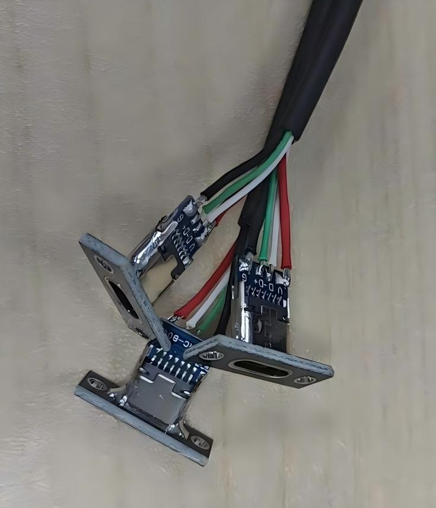
**淘宝购买链接：**

[点击查看 Type-C 调试母座商品（SKU：5102665524058）](https://item.taobao.com/item.htm?id=739748700093&skuId=5102665524058)

> 机架下板为该 Type-C 调试母座预留了专门安装位置。

[返回硬件清单](#hardware-list)

### Type-C 调试公头

**功能简介：** 与母头配合，为调试线、烧录器或外部测试设备提供插接端。直接用废弃数据线加上母座，所以这个type-c公头已经不重要了。

**参考图片：**

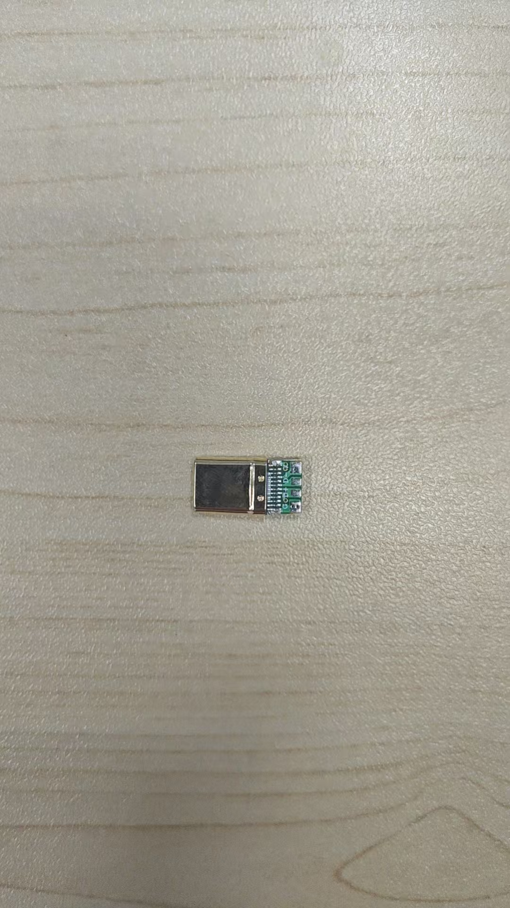
**淘宝购买链接：**

[点击查看 Type-C 调试公头商品（SKU：5077068792858）](https://item.taobao.com/item.htm?id=734551790057&skuId=5077068792858)

[返回硬件清单](#hardware-list)

### DC-DC 降压模块，输出 12V 5A

**功能简介：** 将电池或主电源的较高电压转换为稳定的 12V 电源，为机载计算机、相机或其他设备供电。

**参考图片：**

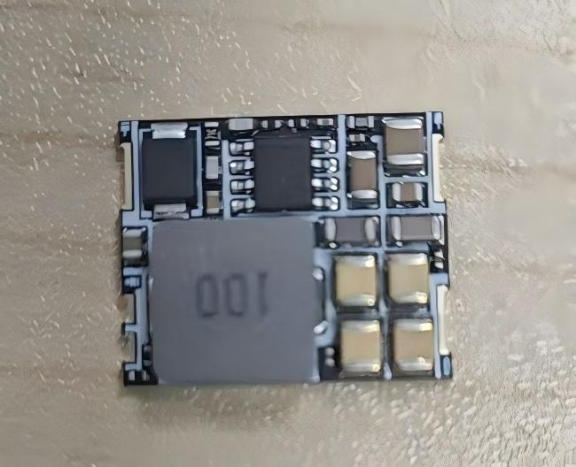
**淘宝购买链接：**

[点击查看 DC-DC 降压模块商品（SKU：6264144190644）](https://item.taobao.com/item.htm?id=677122068881&skuId=6264144190644)

> 用于将 6S 电池电压转换为稳定的 12V，为机载电脑供电。

[返回硬件清单](#hardware-list)

### 铝合金支柱：M3×12mm

**功能简介：** 用于连接上层碳板。

**淘宝购买链接：**

[点击查看 M3×12mm 铝合金支柱商品（SKU：5379794304693）](https://item.taobao.com/item.htm?id=788489376891&skuId=5379794304693)

**参考图片：**

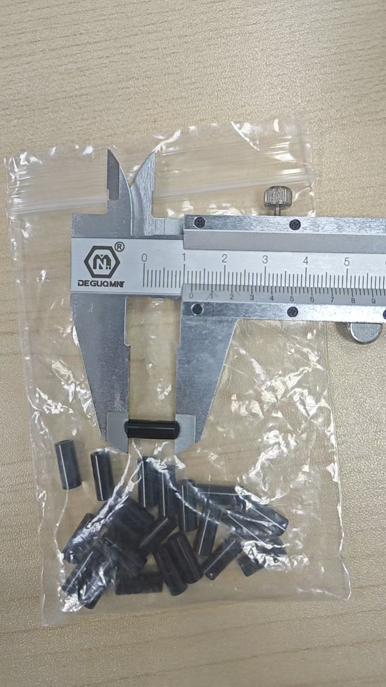
[返回硬件清单](#hardware-list)

### 内六角沉头螺丝M3×10mm

**功能简介：** 用于机架、支柱和设备安装，沉头结构可减少螺丝头突出造成的干涉。

**参考图片：**

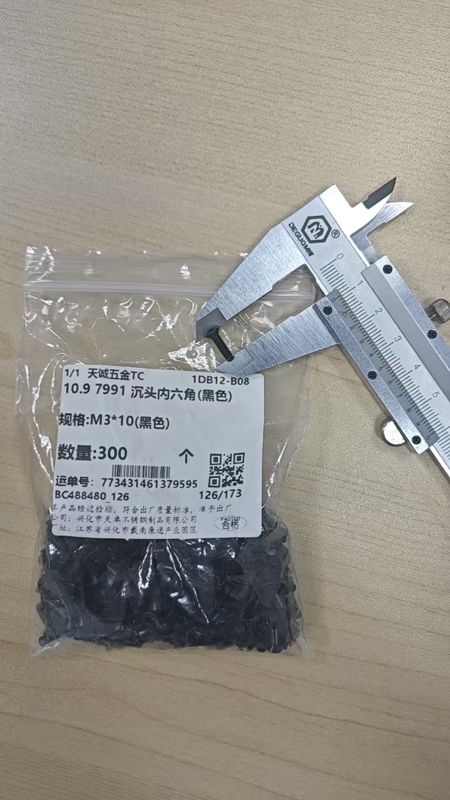
[返回硬件清单](#hardware-list)

### 尼龙螺丝：M2×20mm，白色

**功能简介：** 用于轻量化、绝缘的设备安装和结构固定。

**规格：** 白色尼龙螺丝，M2×20mm，30颗装。

**淘宝购买链接：**

[点击查看商品（商品 ID：43496648279）](https://item.taobao.com/item.htm?id=43496648279)

**参考图片：**

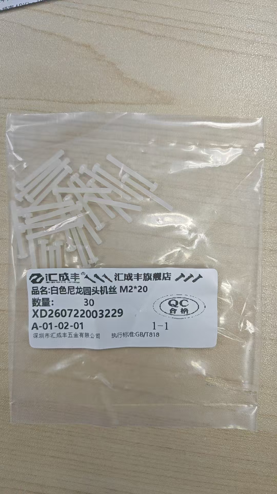
[返回硬件清单](#hardware-list)

### 尼龙螺母：M2，白色

**功能简介：** 与 M2 螺丝配合使用，用于绝缘安装和轻量化固定。

**规格：** 白色尼龙六角螺母，M2，50颗装。

**淘宝购买链接：**

[点击查看商品（商品 ID：38154327797）](https://item.taobao.com/item.htm?id=38154327797)

**参考图片：**

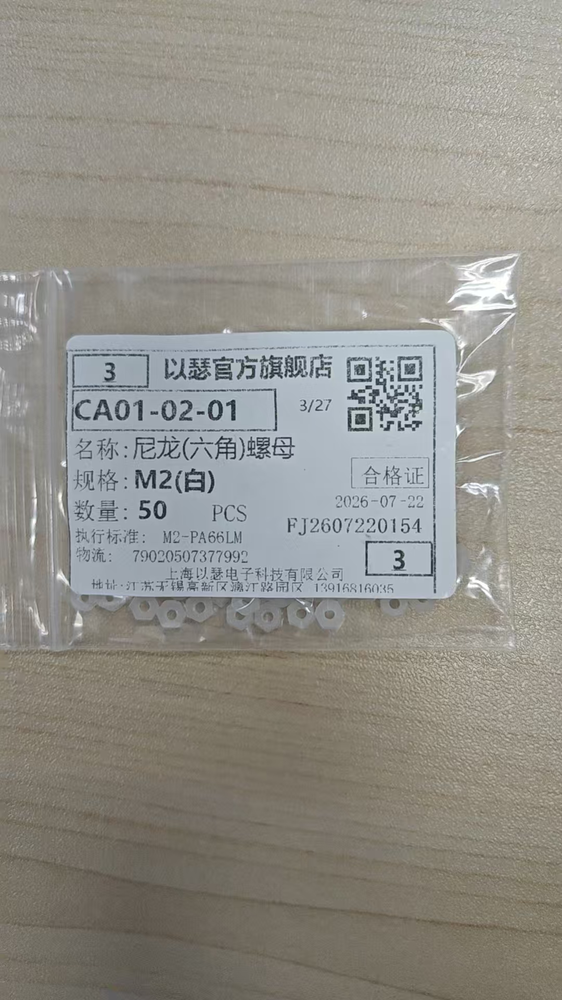
[返回硬件清单](#hardware-list)

### 内六角沉头螺丝：M3×20mm

**功能简介：** 用于飞行器机架、支柱和设备安装的沉头固定，减少螺丝头对周边部件的干涉。

**规格：** M3×20mm，100只装。

**淘宝购买链接：**

[点击查看商品（商品 ID：593668961775）](https://item.taobao.com/item.htm?id=593668961775)

**参考图片：**

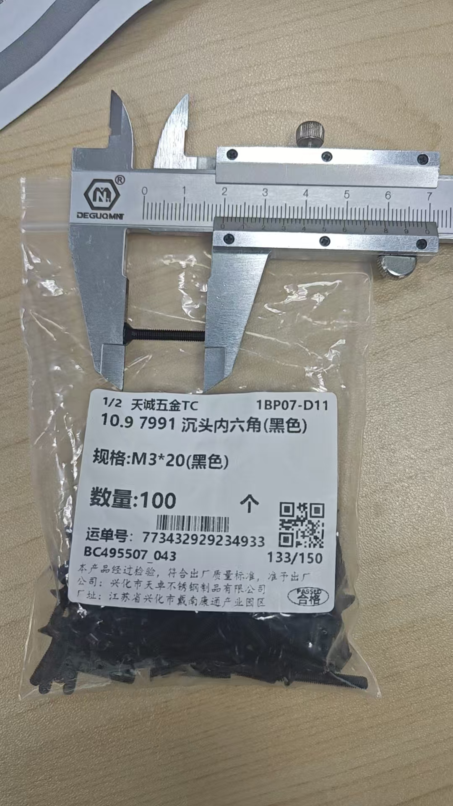
[返回硬件清单](#hardware-list)

### 内六角沉头螺丝：M2.5×10mm

**功能简介：** 用于小型设备、支架和电路板附件的沉头固定。

**规格：** M2.5×10mm，100只装。

**淘宝购买链接：**

[点击查看商品（商品 ID：593668961775）](https://item.taobao.com/item.htm?id=593668961775)

**参考图片：**

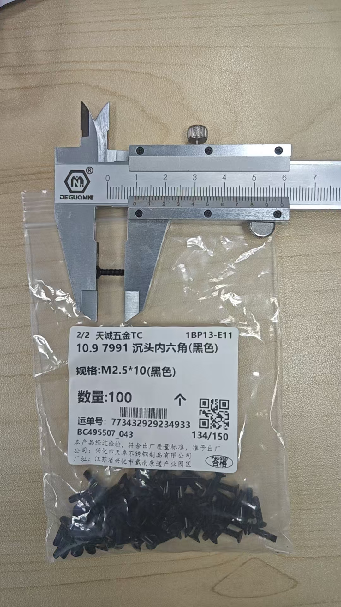
[返回硬件清单](#hardware-list)

### 内六角平头螺丝：M4×8mm

**功能简介：** 用于 M4 孔位的结构固定，平头结构能减少螺丝头突出带来的干涉。

**参考图片：**

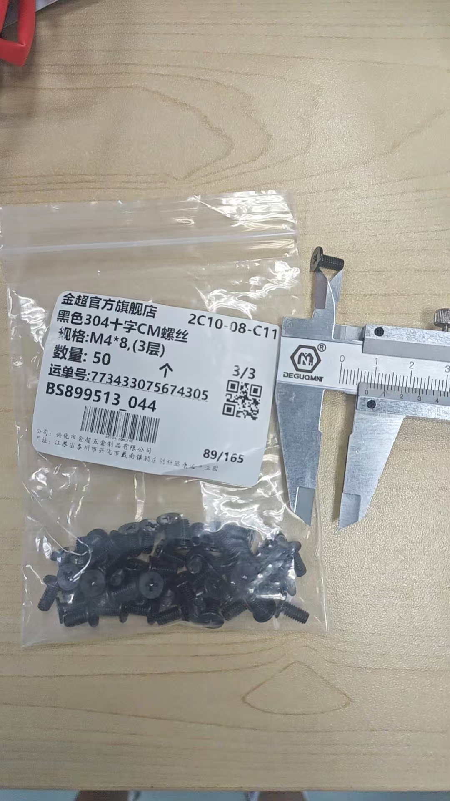
[返回硬件清单](#hardware-list)

### 平头螺丝：M3×12mm

**功能简介：** 用于 M3 孔位的结构连接，可与支柱、防松螺母或其他 M3 固定件配合使用。

**参考图片：**

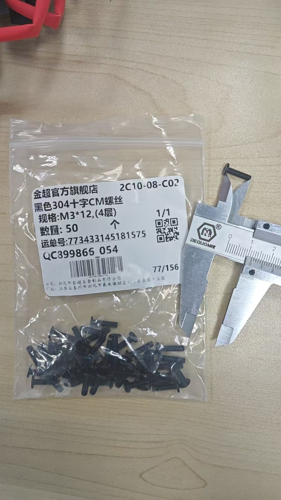
[返回硬件清单](#hardware-list)

### 防松螺母：M3

**功能简介：** 与 M3 螺丝配合，用于振动较大的位置，降低飞行过程中螺丝松动的概率。

**参考图片：**

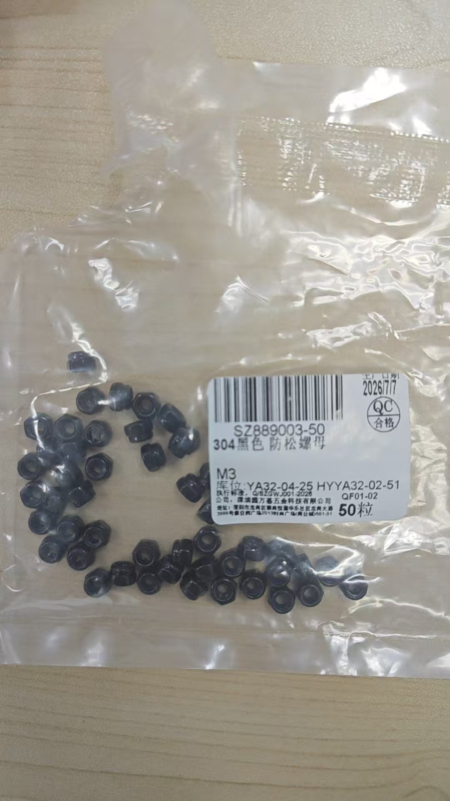
[返回硬件清单](#hardware-list)

### 缓冲泡棉（用于电池，2m）

**功能简介：** 用于电池与碳板之间的缓冲、防滑和减振，降低电池外壳磨损。

[返回硬件清单](#hardware-list)

### 3M 背胶魔术贴：黑色，2cm 宽，3m 勾面 + 3m 毛面

**功能简介：** 用于可拆卸固定电池、电调及其他机载设备，方便后续维护和调整。

**规格：** 黑色，宽 2cm，3m 勾面加 3m 毛面，数量 1 套。

**淘宝购买链接：**

[点击查看商品（商品 ID：911291973150）](https://item.taobao.com/item.htm?id=911291973150)

**参考图片：**

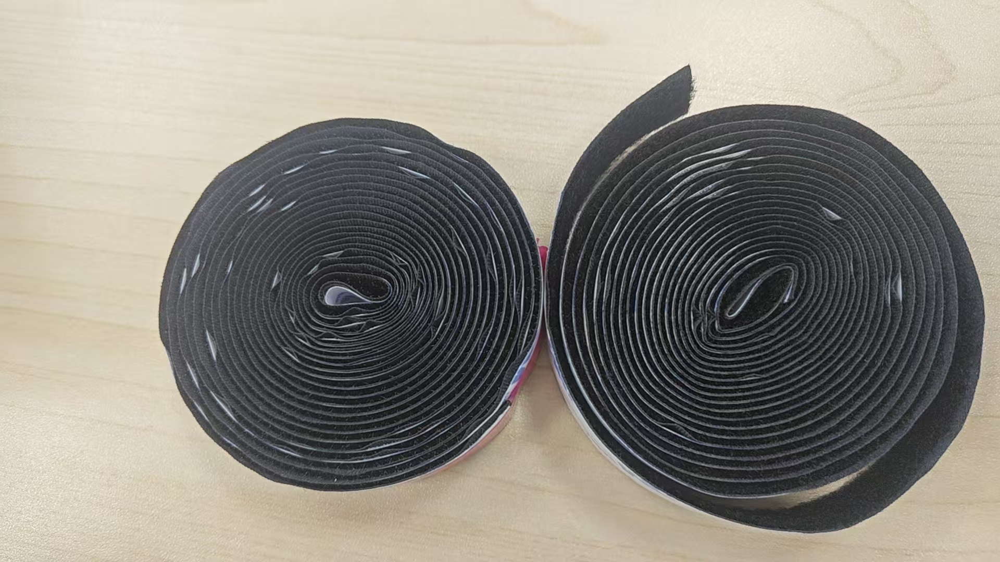
[返回硬件清单](#hardware-list)

### 尼龙扎带：白色，25cm，中粗，100条装

**功能简介：** 用于固定电调、电源线、信号线和其他机架附件，也可作为双面胶固定后的辅助防脱落措施。

**规格：** 白色，25cm，中粗，100条装，数量 1 包。

**淘宝购买链接：**

[点击查看商品（商品 ID：552436283189）](https://item.taobao.com/item.htm?id=552436283189)

**参考图片：**

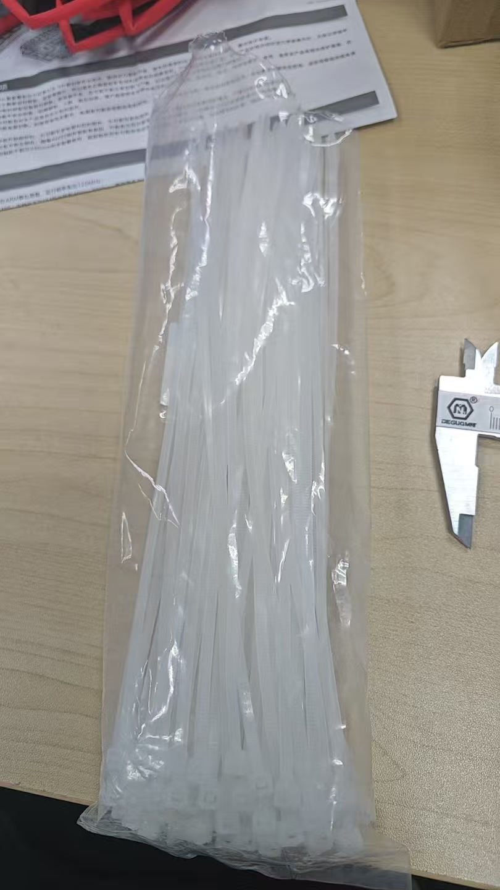
[返回硬件清单](#hardware-list)

### 固态电容：680µF（更紧凑）

**功能简介：** 用于吸收电源瞬态波动和高频噪声，改善电调和飞控供电稳定性。

**淘宝购买链接：**

[点击查看固态电容商品（商品 ID：721200592831）](https://item.taobao.com/item.htm?id=721200592831)

> 用于电池侧稳压；目前安装空间较紧，需要结合机架布局确定固定方式。

**参考图片：**

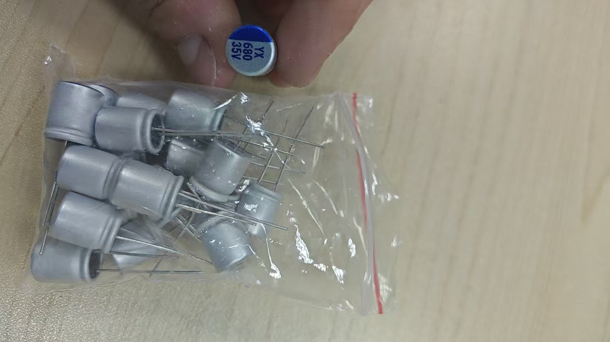
[返回硬件清单](#hardware-list)

### 热缩管：黑色，圆直径 4mm，按 2m 散卖

**功能简介：** 用于电源线、焊点和接插件的绝缘保护及防磨损处理。

**规格：** 黑色，圆直径 4mm，购买长度 2m。

**淘宝购买链接：**

[点击查看商品（商品 ID：631556426007）](https://item.taobao.com/item.htm?id=631556426007)

**参考图片：**

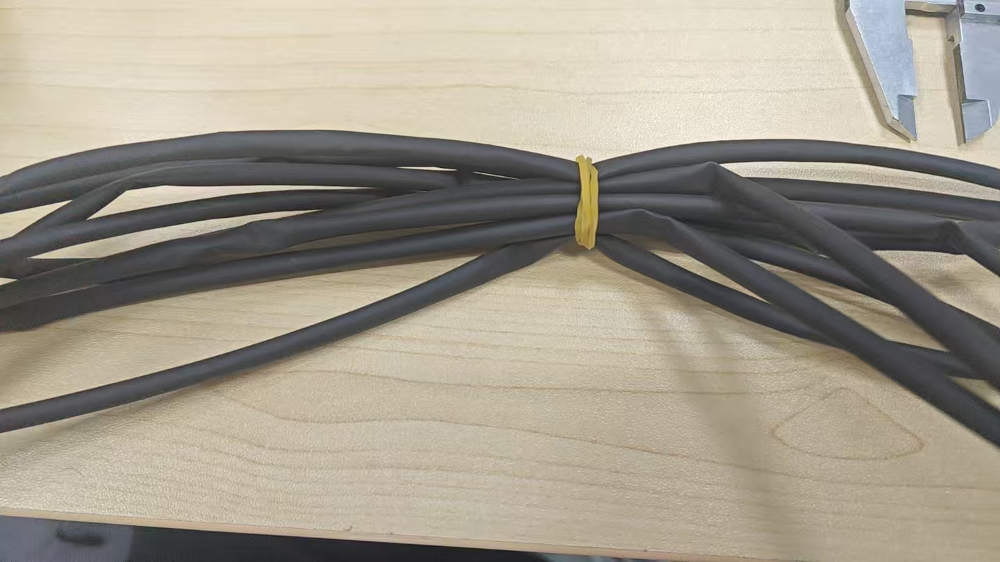
[返回硬件清单](#hardware-list)

### 热缩管：黑色，圆直径 2mm，按 2m 散卖

**功能简介：** 用于较细电线、信号线和焊点的绝缘保护及束线处理。

**规格：** 黑色，圆直径 2mm，购买长度 2m。

**淘宝购买链接：**

[点击查看商品（商品 ID：631556426007）](https://item.taobao.com/item.htm?id=631556426007)

**参考图片：**

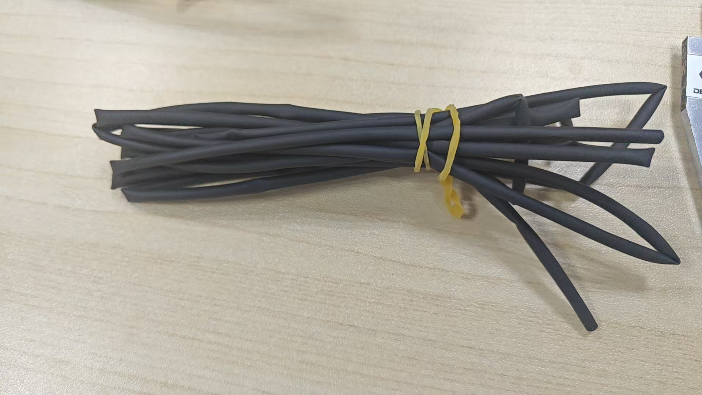
[返回硬件清单](#hardware-list)

### 3K 东丽碳纤维板定制加工

**功能简介：** 用于定制无人机机架、固定翼结构件或其他需要高强度、轻量化的板材部件。

**规格：** 3K 东丽碳纤维板，黑色，固定翼定制加工。订单表中的商品数量为 440，疑似为定制尺寸或计价单位，本清单按 1 项材料订单记录。

**淘宝购买链接：**

[点击查看商品（商品 ID：40340403528）](https://item.taobao.com/item.htm?id=40340403528)

**参考图片：**

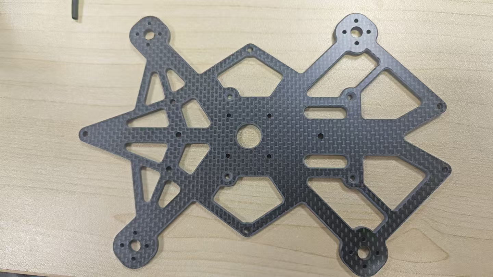
[返回硬件清单](#hardware-list)

### PETG 3D 打印定制件

**功能简介：** 用于制作无人机安装支架、保护件、线束固定件和其他定制结构件。

**规格：** PETG 材料，3D 打印定制加工，数量 6。

**淘宝购买链接：**

[点击查看商品（商品 ID：809701547241）](https://item.taobao.com/item.htm?id=809701547241)

**参考图片：**

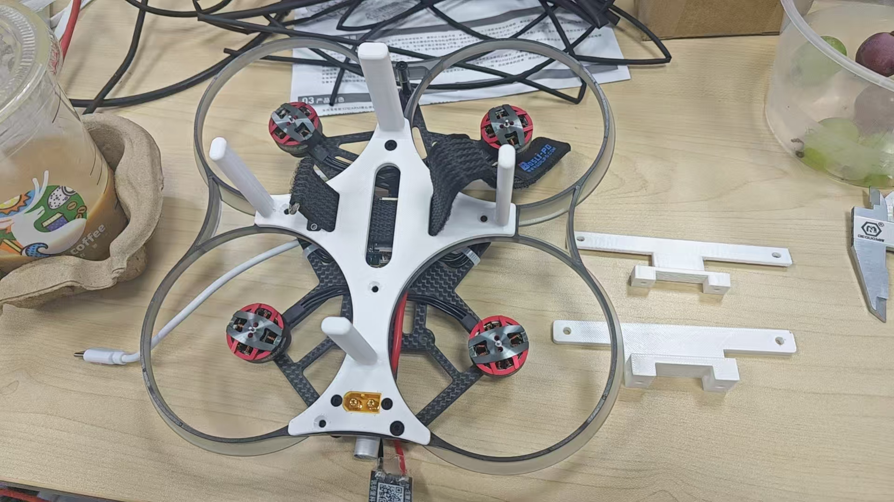
[返回硬件清单](#hardware-list)

### BB 响

**功能简介：** 作为飞控的声音提示器，用于低电量、解锁状态、失控或定位提示。

**参考图片：**

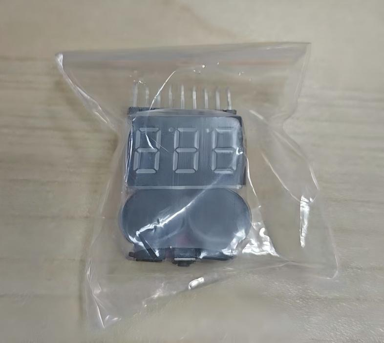
**淘宝购买链接：**

[点击查看 BB 响商品（SKU：5619084980840）](https://item.taobao.com/item.htm?id=843832893059&skuId=5619084980840)

[返回硬件清单](#hardware-list)
