# 无人机安装教程

| 步骤 | 内容 | 详情 |
|---:|---|---|
| 1 | 安装上板螺柱 | [查看详细介绍](#step-01-top-standoff) |
| 2 | 安装电机 | [查看详细介绍](#step-02-motor) |
| 3 | 去除电调上自带的电容 | [查看详细介绍](#step-03-remove-esc-capacitor) |
| 4 | 焊接电机线到电调上 | [查看详细介绍](#step-04-solder-motor-wires) |
| 5 | 组装，安装飞塔 | [查看详细介绍](#step-05-stack) |
| 6 | 理清楚线后用扎带扎紧电机线 | [查看详细介绍](#step-06-tie-motor-wires) |
| 7 | 修复电调和飞控 8pin 控制线引脚不对齐问题，并安装修复后的控制线 | [查看详细介绍](#step-07-fix-8pin-cable) |
| 8 | 连接 DC-DC 变换器输入线与电调电源线，并把电调电源线焊接在 XT60E1-M 上，然后安装电容 | [查看详细介绍](#step-08-power-wiring) |
| 9 | 安装接收机 | [查看详细介绍](#step-09-receiver) |
| 10 | 制作飞控调试 Type-C 口延长线并安装 | [查看详细介绍](#step-10-debug-typec-extension) |
| 11 | 安装电池绑带，组装上板、桨叶保护圈和下板，并固定 XT60E1-M 和 Type-C 延长母座 | [查看详细介绍](#step-11-frame-assembly) |
| 12 | 焊接 DC-DC 变换器和 XT30 母头 | [查看详细介绍](#step-12-dcdc-xt30) |
| 13 | 安装深度相机 | [查看详细介绍](#step-13-depth-camera) |
| 14 | 安装机载电脑 | [查看详细介绍](#step-14-onboard-computer) |

## 安装详细介绍

### 1、安装上板螺柱

**用到的材料：** 上板连接螺柱、M3×12mm 铝合金支柱7颗、M3×10mm 沉头螺丝7颗。

**详细说明：** 按机架孔位安装 M3 螺柱。

**参考图片：**

**操作流程：** 待补充。

**参考图片：**

**操作流程：** 待补充。

[返回安装目录](#install-list)

### 2、安装电机

**用到的材料：** OddityRC 2006 2150KV 无刷电机、配套电机固定螺丝（4颗短的用来安装电机，2颗长的安装桨叶）、机架电机安装位。

**详细说明：** 安装前确认电机孔位和机架正反面，电机安装在反面；固定时注意螺丝长度，避免螺丝顶到电机绕组。所有电机先轻锁定位，确认无误后再逐个锁紧，按对角线顺序安装螺丝。

**参考图片：**

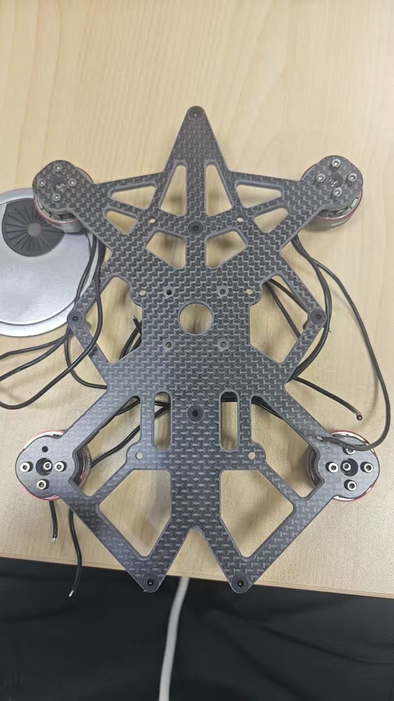

**操作流程：** 待补充。

**参考图片：**

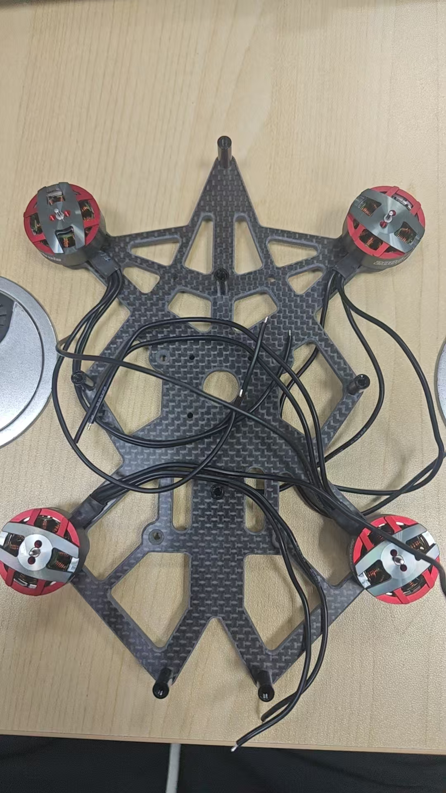

**操作流程：** 待补充。

[返回安装目录](#install-list)

### 3、去除电调上自带的电容

**用到的材料：** 45A 四合一电调、电烙铁、焊锡、钳子。

**详细说明：** 操作前确认电调完全断电，并记录原电容正负极方向。拆除时避免长时间加热焊盘，防止焊盘脱落；在去除黑色注胶后，双人操作，一人负责加热焊点，一人负责在电容松动后用钳子取下电容。

**参考图片：**

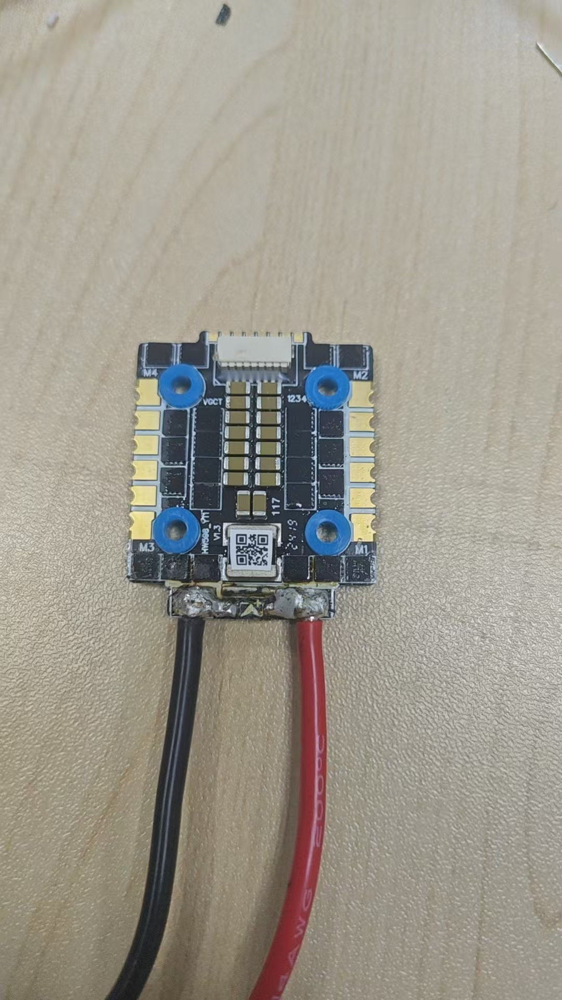

**操作流程：** 待补充。

[返回安装目录](#install-list)

### 4、焊接电机线到电调上

**用到的材料：** 四个无刷电机、45A 四合一电调、焊锡丝、电烙铁。

**详细说明：** 焊接前先按电机位置整理线长，尽量保持左右对称和走线清晰。三相线初始顺序可以先按方便焊接排列，后续可在飞控或电调配置中调整电机方向；焊完后检查是否有虚焊、连锡和线皮烫伤，注意电调上的M1,M2,M3,M4丝印要与电机实际安装方位对应，电调，要预先上锡。

**参考图片：**

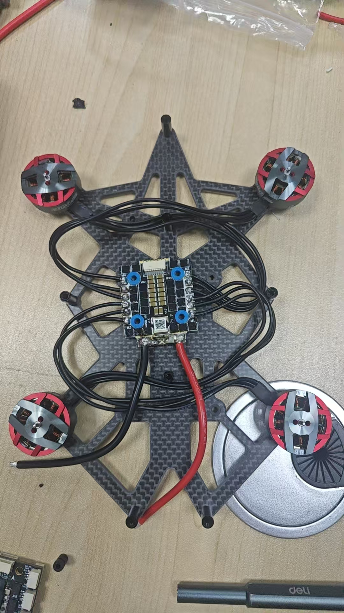

**操作流程：** 待补充。

**参考图片：**

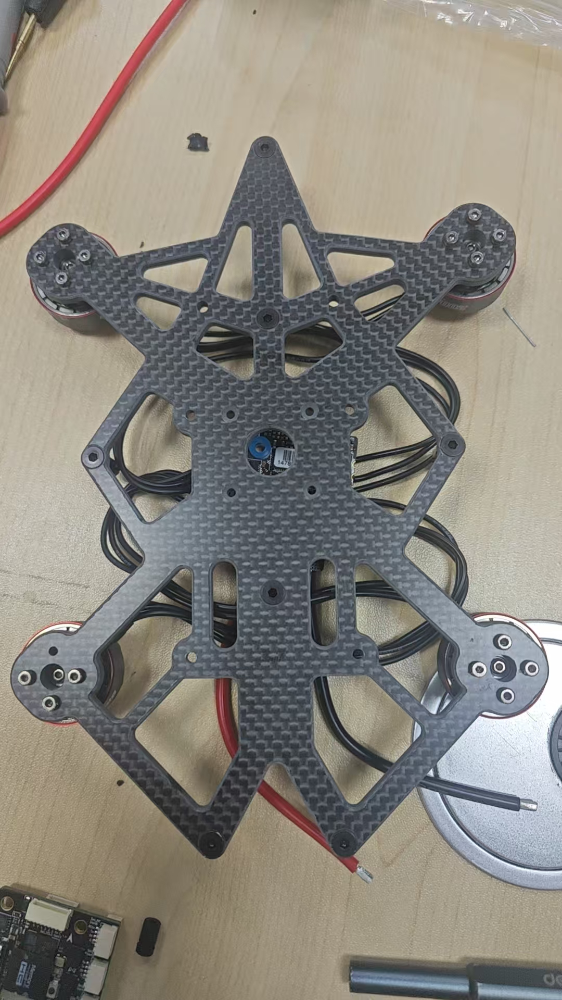

**操作流程：** 待补充。

[返回安装目录](#install-list)

### 5、组装，安装飞塔

**用到的材料：** 飞控 NxtPX4、45A 四合一电调、尼龙螺丝4颗、尼龙螺母8颗、飞控减震硅胶柱。

**详细说明：** 安装时保持飞控箭头方向与机头一致，确认减震、螺丝长度和板间距合适。锁紧前检查电调、飞控、线束和碳板之间没有短路风险，电调安装在靠近碳板侧，飞控安装在远离碳板侧。

**参考图片：**

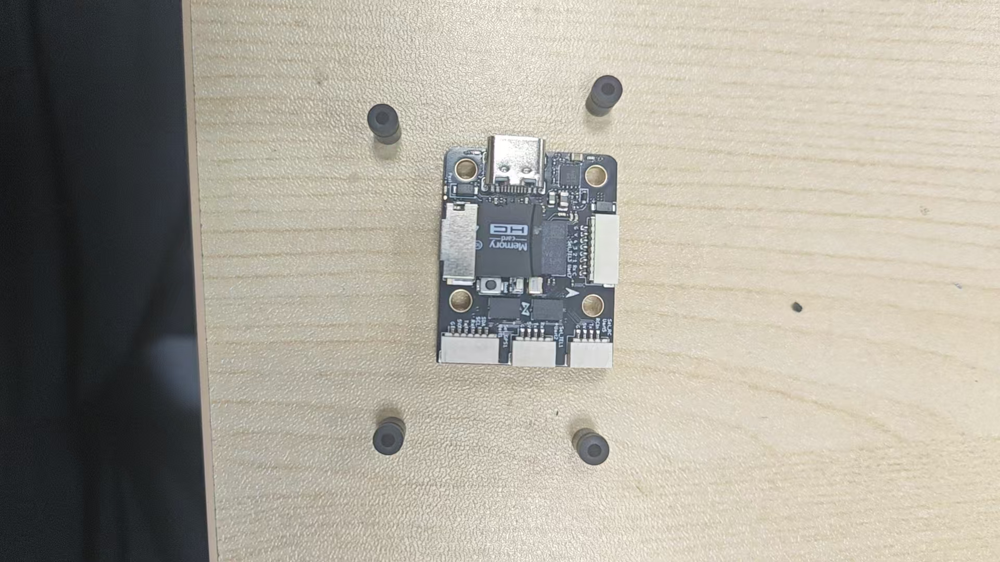

**操作流程：** 待补充。

**参考图片：**

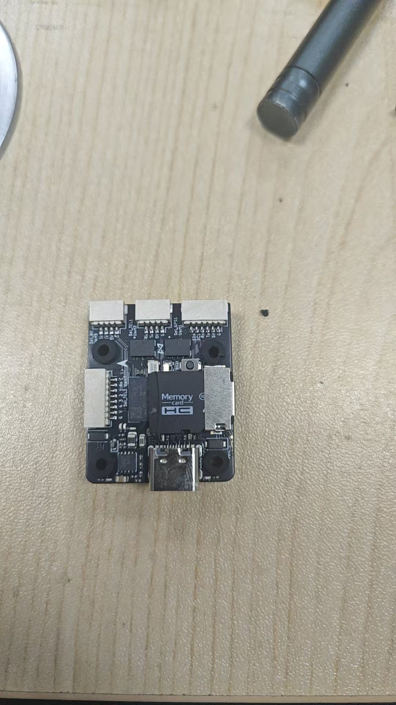

**操作流程：** 待补充。

**参考图片：**

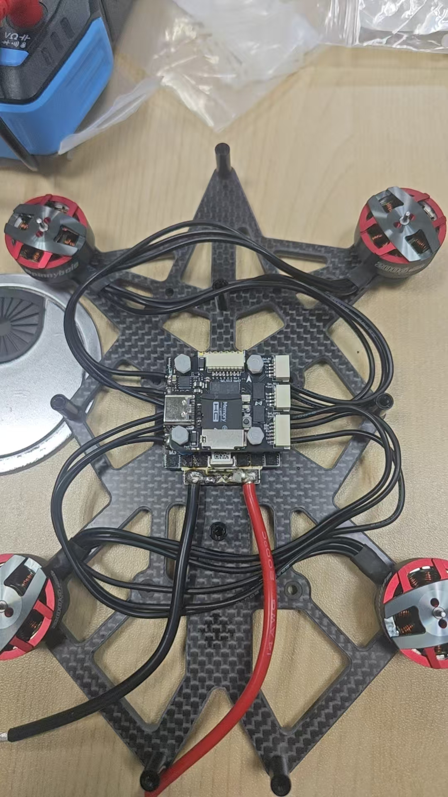

**操作流程：** 待补充。

[返回安装目录](#install-list)

### 6、理清楚线后用扎带扎紧电机线

**用到的材料：** 已焊接好的电机线、尼龙扎带。

**详细说明：** 线束应沿机架边缘或预定走线路径布置，保留少量维修余量。扎带锁紧后剪掉多余尾部，剪口不要朝向线材，避免飞行振动时磨破绝缘层。

**参考图片：**

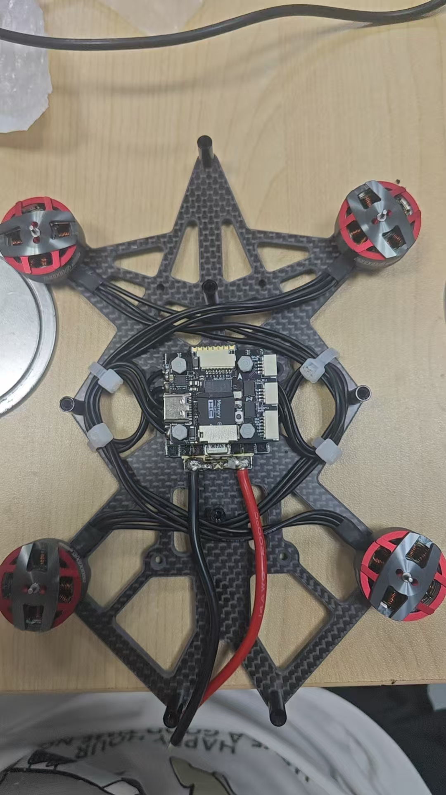

**操作流程：** 待补充。

[返回安装目录](#install-list)

### 7、修复电调和飞控 8pin 控制线引脚不对齐问题，并安装修复后的控制线

**用到的材料：** 8pin 控制线、烙铁、焊锡丝、2mm热缩管、助焊剂、剪刀、万用表。

**详细说明：** 先分别查清飞控端和电调端的 8pin 定义，包括电源、地线、电流检测、通信和四路电机信号。按实际定义重新调整线序，安装前用万用表确认连续性和是否短路，再接入飞控与电调。

**参考图片：**

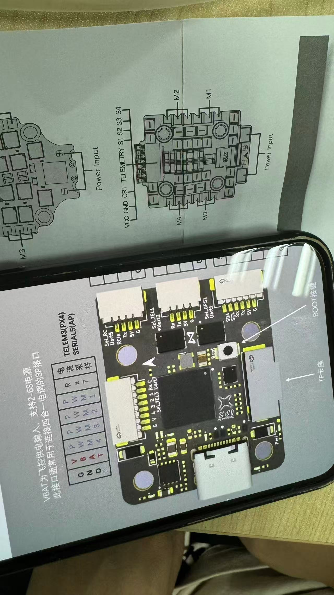

**操作流程：** 待补充。

**参考图片：**

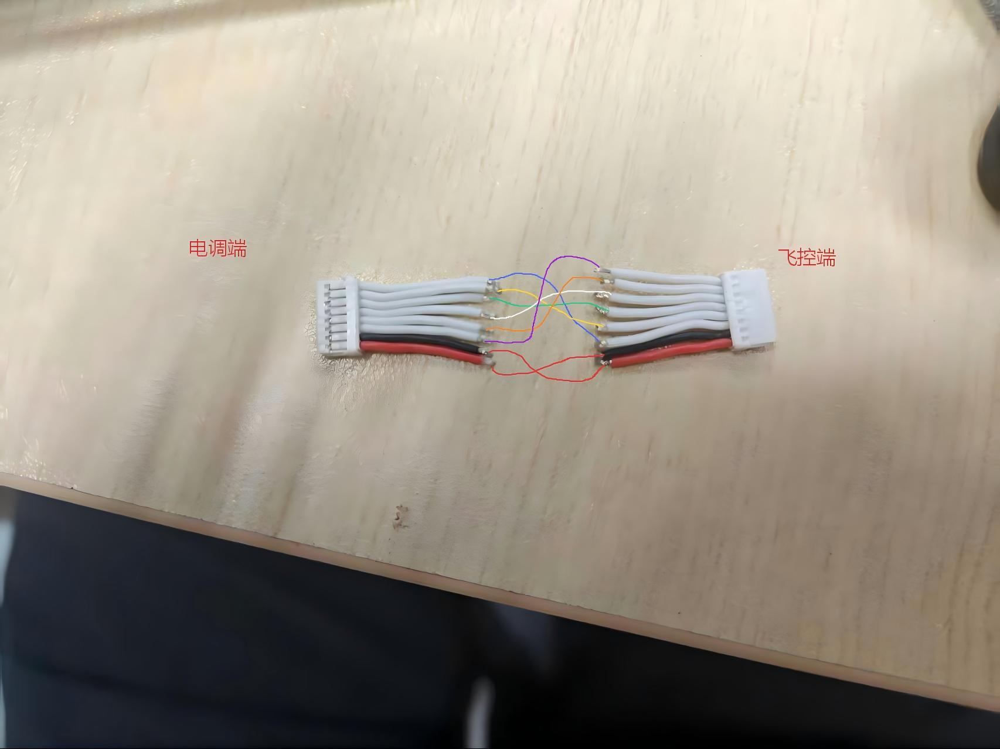

**操作流程：** 待补充。

**参考图片：**

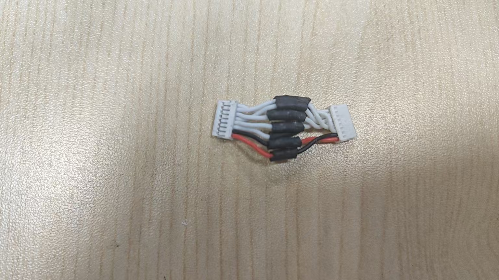

**操作流程：** 待补充。

**参考图片：**

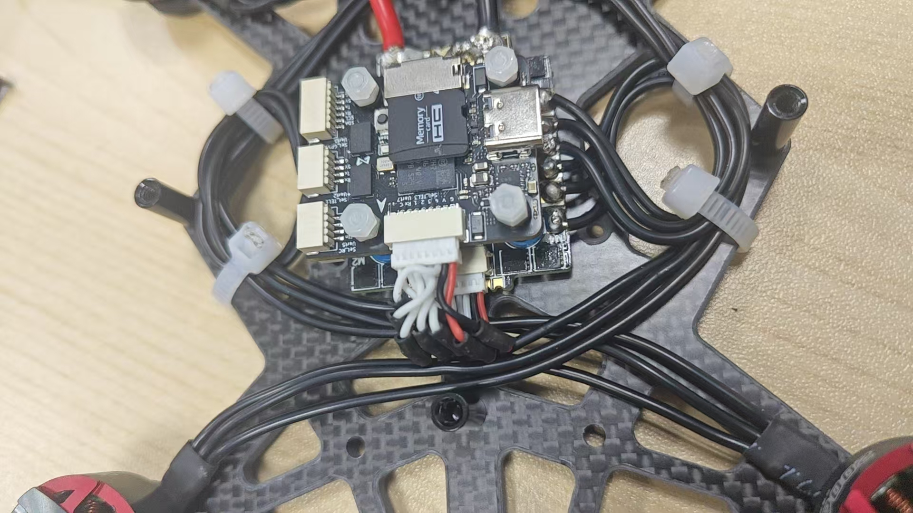

**操作流程：** 待补充。

[返回安装目录](#install-list)

### 8、连接 DC-DC 变换器输入线与电调电源线，并把电调电源线焊接在 XT60E1-M 上，然后安装电容

**用到的材料：** 电调电源线、XT60E1-M、固态电容、18AWG 电源线、电工胶布、烙铁、焊锡丝、剥线钳。

**详细说明：** 将作为DC-DC 输入的18awg线并接到电调电源线，电调主电源线焊接到 XT60E1-M；所有电源焊点都要确认正负极。电容安装在电源输入附近，注意极性和固定方式，避免引脚裸露接触碳板，XT60E1-M预先上锡，刚刚填上那个小洞就行，18awg电线要拨出来一部分电线分成两束，电调电源线也播出来一部分，然后把18awg线缠绕在电调电源线上，然后上锡，然后把电调电源线焊在公头上，然后在合适的位置焊上电容，电容位置要确保第10步不影响安装，之后缠绕电工胶布。

**参考图片：**

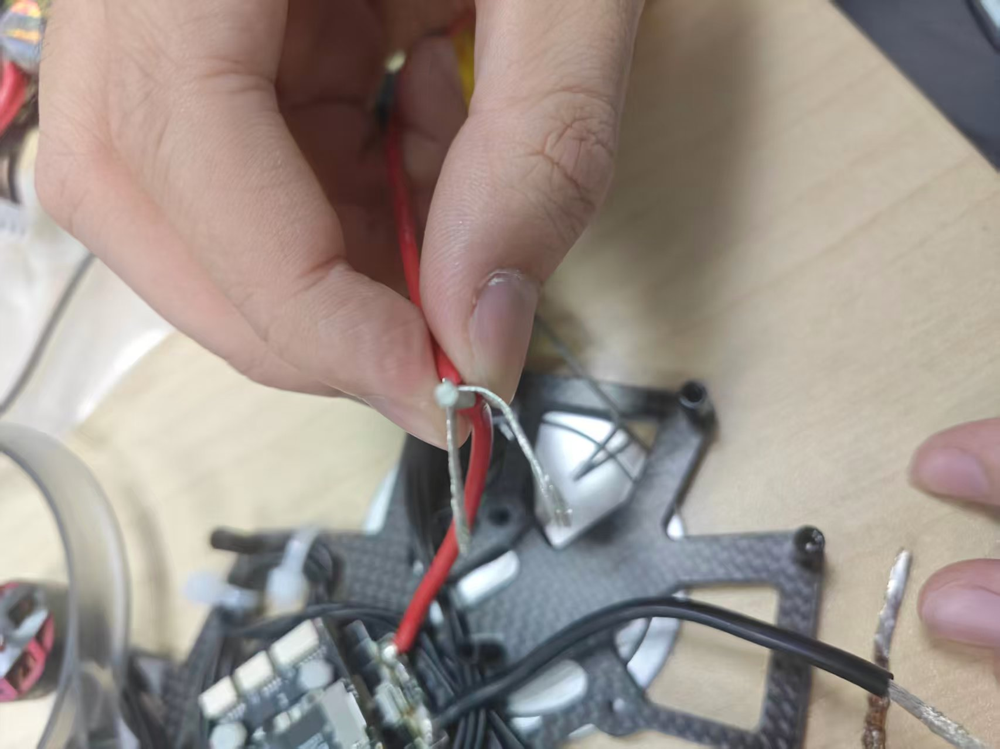

**操作流程：** 待补充。

**参考图片：**

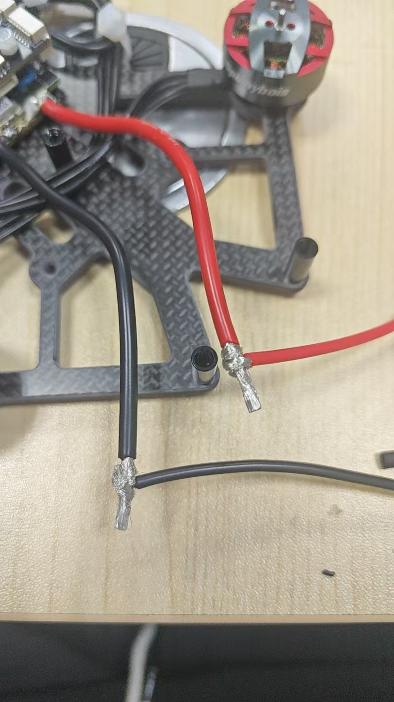

**操作流程：** 待补充。

**参考图片：**

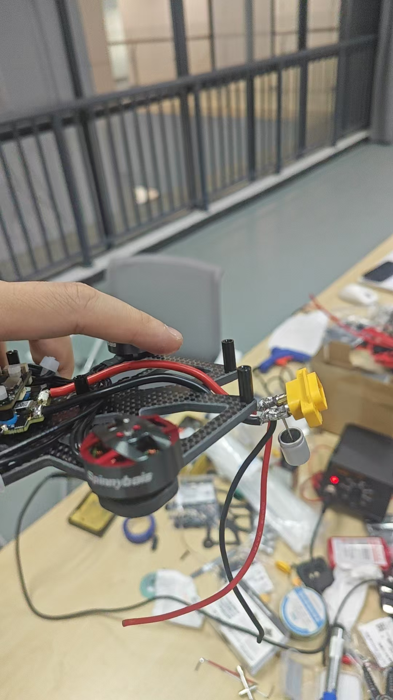

**操作流程：** 待补充。

[返回安装目录](#install-list)

### 9、安装接收机

**用到的材料：** 接收机、接收机连接线、魔术贴或尼龙扎带。

**详细说明：** 将接收机固定在机架内相对远离电调和大电流电源线的位置，天线尽量避开碳板遮挡。按飞控接口定义连接电源、地线和信号线，固定后确认线束不会被上板、桨叶保护圈或其他结构件挤压。

**参考图片：**

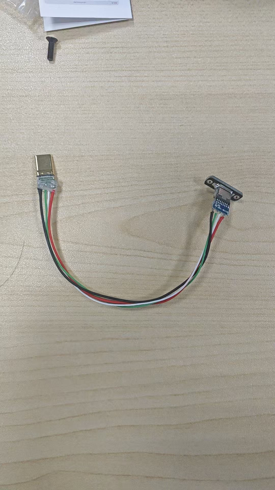

**操作流程：** 待补充。

**参考图片：**

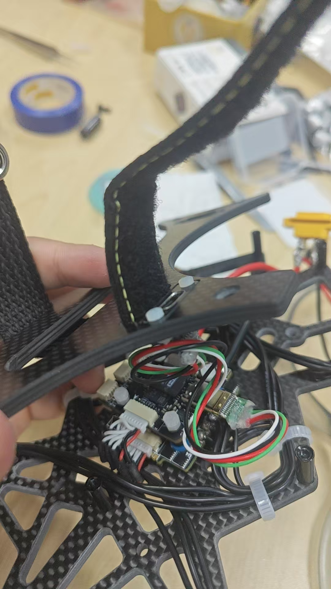

**操作流程：** 待补充。

[返回安装目录](#install-list)

### 10、制作飞控调试 Type-C 口延长线并安装

**用到的材料：** Type-C 调试母座、Type-C（4pin）公头、电工胶布、焊锡丝、烙铁。

**详细说明：** 按飞控调试接口针脚定义制作延长线，并将 Type-C 母座固定在机架下板预留位置。安装后检查插拔方向、线序和连接稳定性，避免调试时反复拆机。

**参考图片：**

**操作流程：** 待补充。

[返回安装目录](#install-list)

### 11、安装电池绑带，组装上板、桨叶保护圈和下板，并固定 XT60E1-M 和 Type-C 延长母座

**用到的材料：** 电池绑带、上板、下板、桨叶保护圈、XT60E1-M、Type-C 延长母座、M3 *20螺丝6颗、M2.5\*10 2两颗、M2.5\*7 沉头螺丝4颗。

**详细说明：** 先穿好电池绑带，再组合上板、桨叶保护圈和下板。XT60E1-M 与 Type-C 延长母座应固定在机架预留位置，XT60E1-M需要拿剪刀切去一个小缺口，以便穿过桨叶保护圈，安装后确认接口不松动、不遮挡线束，也不会和桨叶保护圈干涉。

**参考图片：**

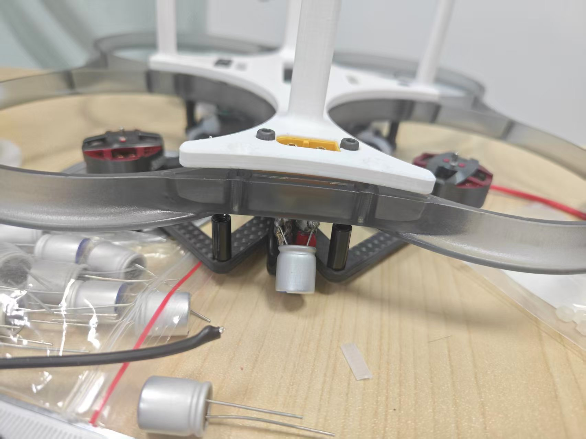

**操作流程：** 待补充。

**参考视频：**

<video src="./安装images/安装教程第11步11.2.mp4" controls width="720"></video>

[如果视频无法直接播放，点击查看视频文件](./安装images/安装教程第11步11.2.mp4)

**操作流程：** 待补充。

[返回安装目录](#install-list)

### 12、焊接 DC-DC 变换器和 XT30 母头

**用到的材料：** DC-DC 降压模块、XT30 母头、18AWG 红黑电源线、25mm 热缩管。

**详细说明：** 焊接前先调好或确认 DC-DC 输出电压，红线接正极，黑线接负极。XT30 母头焊接完成后套热缩管绝缘，通电前用万用表确认输出电压和极性。

**参考图片：**

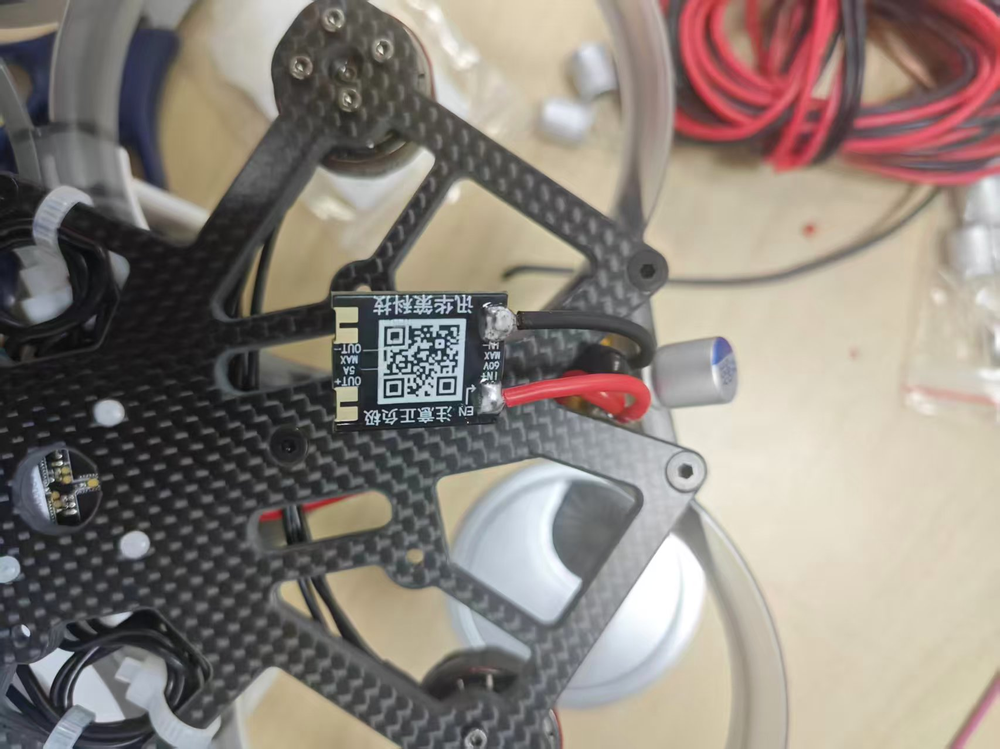

**操作流程：** 待补充。

**参考图片：**

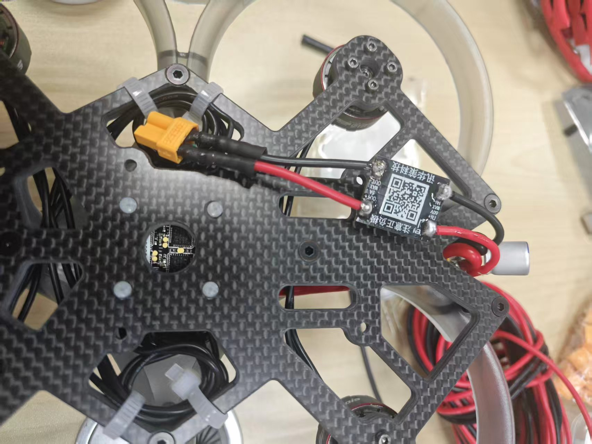

**操作流程：** 待补充。

**参考图片：**

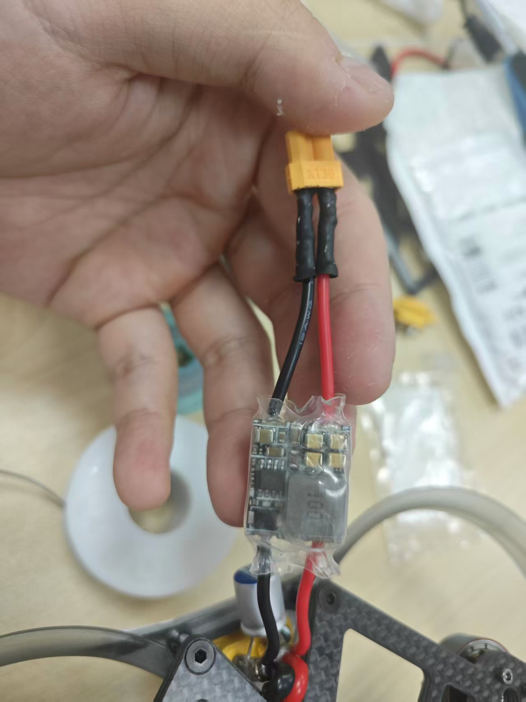

**操作流程：** 待补充。

[返回安装目录](#install-list)

### 13、安装深度相机

**用到的材料：** RealSense D455 深度相机、相机 Type-C 线、PETG 相机安装打印件、M4\*8螺丝2颗，M3\*12平头螺丝2颗，M3防松螺母2颗。

**详细说明：** 深度相机应安装在视野无遮挡、结构刚性较好的位置。固定后整理 Type-C 数据线，保证线材不会被桨叶保护圈、上板或其他部件挤压。

**参考图片：**

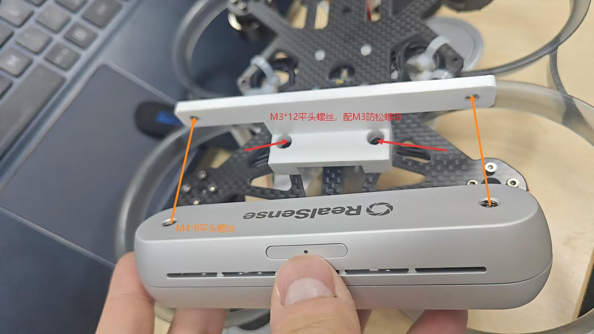

**操作流程：** 待补充。

[返回安装目录](#install-list)

### 14、安装机载电脑

**用到的材料：** Nvidia Orin NX 机载电脑、XT30 供电线、相机 Type-C 线、配套赠送的固定螺丝。

**详细说明：** 将机载电脑固定在机架规划位置，连接 XT30 供电线和深度相机 Type-C 线。首次上电前确认 DC-DC 输出电压稳定、接口极性正确，并检查线束不会影响机架闭合。

**参考图片：**

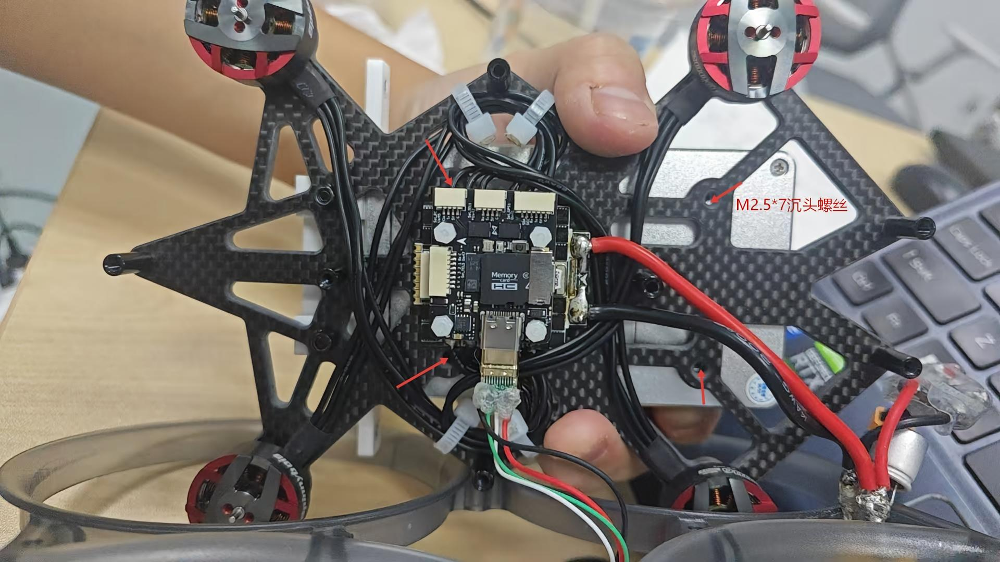

**操作流程：** 待补充。

[返回安装目录](#install-list)
## 安装完成效果图

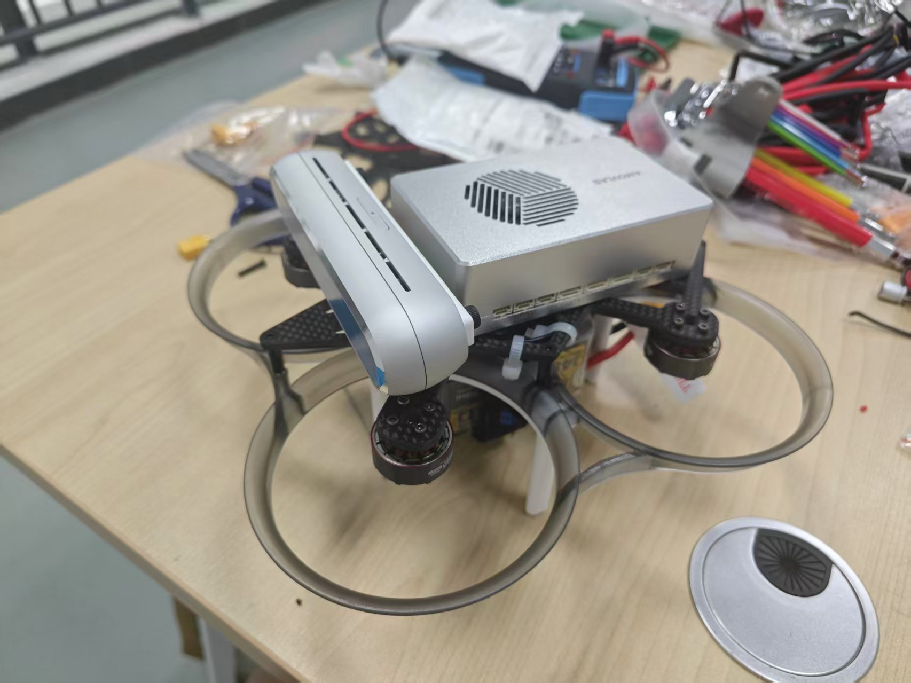

**操作流程：** 待补充。
